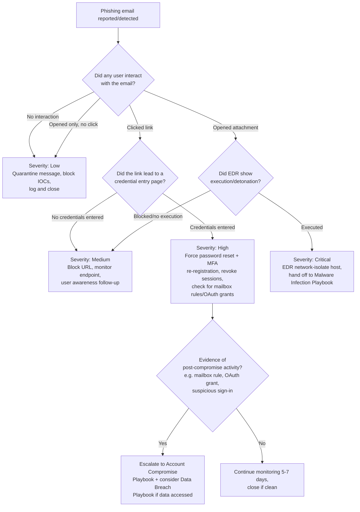
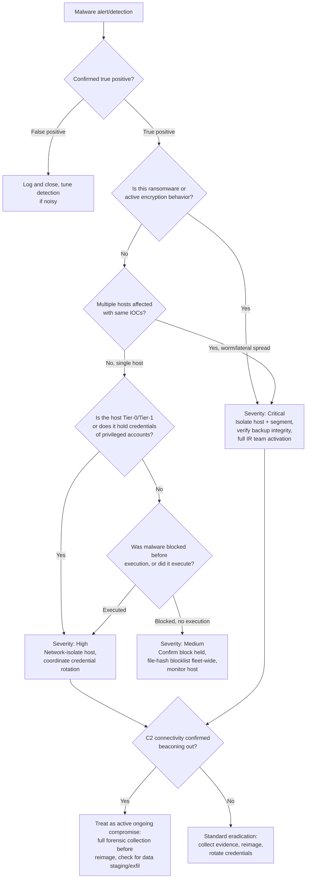
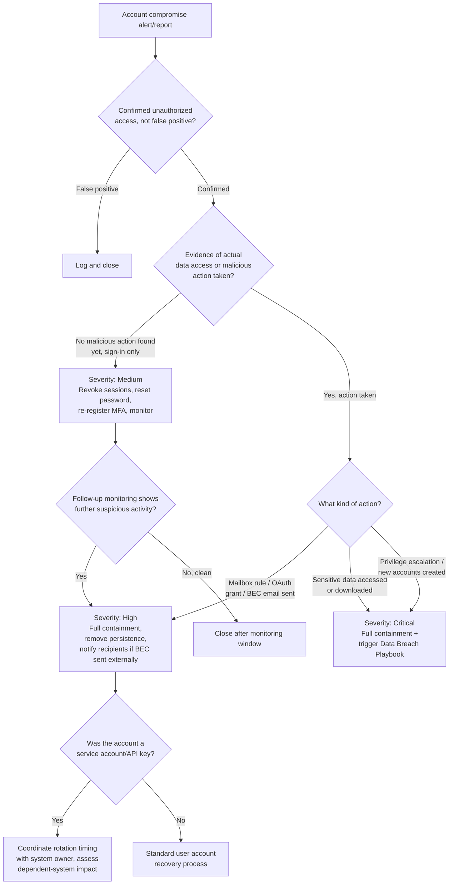
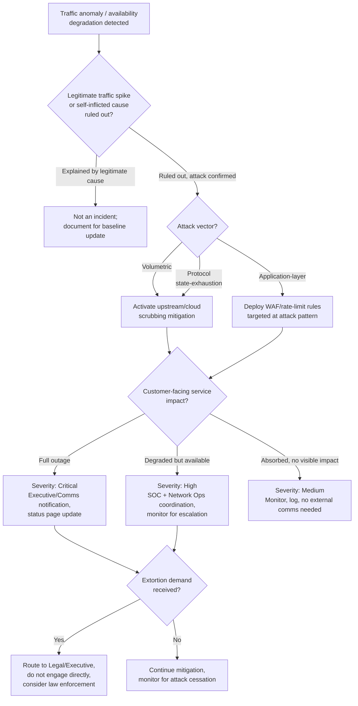

# Incident Response Playbooks

A set of five incident-type playbooks — **Phishing, Malware Infection, Account Compromise, Data
Breach, and DDoS** — built for Tier-1/Tier-2 SOC analysts to execute consistently, regardless of
which analyst is on shift when an incident lands. Each playbook is authored as a standalone,
step-by-step procedure: what to check, what to preserve as evidence, when and to whom to escalate,
and what to communicate to stakeholders at each stage — grounded in published NIST and CISA
guidance rather than improvised process.

**Author:** Omar Babba · **Status:** Living documents, reviewed quarterly · **Last updated:** 2026-07-11

## Table of contents

- [Framework basis](#framework-basis)
- [Why this repo uses the SANS six-phase model operationally](#why-this-repo-uses-the-sans-six-phase-model-operationally)
- [Playbooks in this repo](#playbooks-in-this-repo)
- [Shared templates](#shared-templates)
- [Severity matrix](#severity-matrix-used-consistently-across-all-five-playbooks)
- [Incident impact classification (NIST/CISA-aligned)](#incident-impact-classification-nistcisa-aligned)
- [Decision-tree diagrams](#decision-tree-diagrams)
- [Repository structure](#repository-structure)
- [Full Playbooks](#full-playbooks)
  - [Phishing Incident Response](#phishing-incident-response)
  - [Malware Infection Response](#malware-infection-response)
  - [Account Compromise Response](#account-compromise-response)
  - [Data Breach Response](#data-breach-response)
  - [DDoS Attack Response](#ddos-attack-response)
- [References](#references)

## Framework basis

This repository is built on two authoritative, publicly published sources, not internal opinion:

- **[NIST SP 800-61 Rev. 2](https://csrc.nist.gov/pubs/sp/800/61/r2/final), *Computer Security
  Incident Handling Guide*** (Aug. 2012) — the classic, four-phase incident-handling lifecycle
  (Preparation → Detection & Analysis → Containment, Eradication & Recovery → Post-Incident
  Activity). This is the model most SOC teams, certifications (GCIH, Security+), and
  federal/enterprise IR programs are actually built around today, and the one
  [CISA's own Federal Government Cybersecurity Incident and Vulnerability Response
  Playbooks](https://www.cisa.gov/resources-tools/resources/federal-government-cybersecurity-incident-and-vulnerability-response-playbooks)
  (Aug. 2024) explicitly cite as their process foundation.
- **[NIST SP 800-61 Rev. 3](https://csrc.nist.gov/pubs/sp/800/61/r3/final), *Incident Response
  Recommendations and Considerations for Cybersecurity Risk Management: A CSF 2.0 Community
  Profile*** (April 2025) — the current official replacement for Rev. 2. Rev. 3 deliberately
  **drops the standalone four-phase lifecycle** and instead maps incident-response activities
  across all six functions of the [NIST Cybersecurity Framework (CSF)
  2.0](https://www.nist.gov/cyberframework): Govern, Identify, Protect, Detect, Respond, Recover.
  The intent is to stop treating incident response as an isolated, bolt-on activity and instead
  fold it into continuous risk management — Preparation becomes an ongoing Govern/Identify/
  Protect responsibility rather than a one-time pre-incident checklist item.

**Both are cited here deliberately, not by oversight.** Rev. 3 is the current, correct reference
if you're asked "what does NIST currently publish on this," and this repo says so plainly rather
than quietly citing an outdated document as if it were still current. But Rev. 2's phase model
(and SANS' more granular six-phase derivative of it) remains the dominant *operational* structure
actually used for day-to-day incident handling, playbook authoring, and analyst training — CISA's
own 2024 federal playbooks are built on it, not on Rev. 3's function-mapping approach. Rev. 3 is a
governance/risk-integration document; it is not written as an analyst run-book, and doesn't
attempt to be one. These playbooks are run-books, so they use the lifecycle model Rev. 3
explicitly superseded at the framework level while remaining consistent with Rev. 3's underlying
guidance in substance (detection, containment, eradication, recovery, and lessons-learned
activities are all still exactly what Rev. 3 expects — they're just described under CSF 2.0
function headers there instead of standalone phases).

## Why this repo uses the SANS six-phase model operationally

SANS' six-phase model — **Preparation, Identification, Containment, Eradication, Recovery,
Lessons Learned** — is the same underlying lifecycle as NIST SP 800-61 Rev. 2 at finer
granularity: it splits Rev. 2's "Detection & Analysis" into a standalone **Identification** phase,
and splits "Containment, Eradication & Recovery" into three distinct phases. Every playbook in
this repo is organized by these six phases for step-by-step analyst clarity, with an explicit
mapping back to the NIST Rev. 2 model so either framework reference works when talking to
auditors, management, or anyone trained on the other terminology.

| SANS phase | Maps to NIST SP 800-61 Rev. 2 phase | Maps to CSF 2.0 function (Rev. 3) |
|---|---|---|
| Preparation | Preparation | Govern, Identify, Protect |
| Identification | Detection & Analysis | Detect |
| Containment | Containment, Eradication & Recovery | Respond |
| Eradication | Containment, Eradication & Recovery | Respond |
| Recovery | Containment, Eradication & Recovery | Recover |
| Lessons Learned | Post-Incident Activity | Govern (continuous improvement) |

## Playbooks in this repo

| Playbook | Covers | Severity range | Primary supporting reference |
|---|---|---|---|
| [Phishing Incident](playbooks/phishing-incident-playbook.md) | Reported/detected phishing emails, credential-harvesting links, malicious attachments | Low–Critical (depends on click/credential-entry outcome) | NIST SP 800-61 Rev. 2 §3 |
| [Malware Infection](playbooks/malware-infection-playbook.md) | Endpoint malware detection (AV/EDR alert, ransomware, trojans, worms) | Medium–Critical | [NIST SP 800-83 Rev. 1](https://csrc.nist.gov/pubs/sp/800/83/r1/final), CISA [#StopRansomware Guide](https://www.cisa.gov/stopransomware/ransomware-guide) |
| [Account Compromise](playbooks/account-compromise-playbook.md) | Stolen/abused credentials, impossible-travel logins, BEC | Medium–Critical | NIST SP 800-61 Rev. 2 §3 |
| [Data Breach](playbooks/data-breach-playbook.md) | Unauthorized access to or exfiltration of sensitive data | High–Critical | NIST SP 800-61 Rev. 2 §3; GDPR Art. 33 (72-hour notification) |
| [DDoS Attack](playbooks/ddos-attack-playbook.md) | Volumetric/protocol/application-layer denial of service | Medium–Critical | NIST SP 800-61 Rev. 2 §3 |

Each playbook follows the same section structure so any analyst can move between them without
relearning the format:

```
Purpose · Scope · Prerequisites · Detection Criteria · Response Steps (by SANS phase)
· Decision Tree · Escalation Procedures · Evidence Collection · Recovery Actions
· Communication Templates · Post-Incident Activities
```

## Shared templates

Reusable, incident-type-agnostic templates live in [templates/](templates/):

- [Stakeholder Notification Template](templates/stakeholder-notification-template.md)
- [Executive Summary Template](templates/executive-summary-template.md)
- [Post-Incident Review Template](templates/post-incident-review-template.md)
- [Evidence Chain-of-Custody Log](templates/chain-of-custody-template.md)

## Severity matrix (used consistently across all five playbooks)

| Severity | Definition | Initial response time | Who's notified |
|---|---|---|---|
| **Critical** | Active data exfiltration, ransomware detonation, domain admin compromise, business-critical system down | Immediate (page on-call) | CISO, IT leadership, Legal, possibly executive team/board |
| **High** | Confirmed compromise contained to limited scope, credential theft with evidence of use, malware on a sensitive system | < 30 minutes | SOC lead, IT manager, system owner |
| **Medium** | Suspicious activity requiring investigation, single-user phishing click without credential entry, isolated malware detection auto-contained by EDR | < 2 hours | SOC lead |
| **Low** | Reported phishing with no interaction, blocked/failed attack attempts, informational alerts | Next business day (documented, queued) | Logged only, no active notification |

This four-tier matrix is deliberately simple for fast triage decisions inside each playbook. For
incidents that require formal reporting up to leadership, regulators, or a parent
organization/ISAC, cross-reference it against the three-axis classification below, which is what
CISA and federal agencies actually use for incident scoring.

## Incident impact classification (NIST/CISA-aligned)

The [US-CERT/CISA Federal Incident Notification
Guidelines](https://www.cisa.gov/federal-incident-notification-guidelines) and CISA's National
Cyber Incident Scoring System (NCISS) — both built on NIST SP 800-61's incident-categorization
guidance — score an incident along three independent axes rather than a single severity label.
This repo's playbooks reference this triad wherever precision matters more than the four-tier
matrix's speed (e.g. for the Executive Summary and Post-Incident Review templates):

| Axis | What it measures | Example range |
|---|---|---|
| **Functional Impact** | Effect on the organization's ability to deliver business/mission functions | No impact → Low → Medium (some services degraded) → High (significant services down) → Critical (organization-wide loss of a critical function) |
| **Information Impact** | Effect on the confidentiality, integrity, and availability of the organization's information | No impact → Privacy breach of a small dataset → Proprietary information breach → Integrity loss → Critical system/data destruction |
| **Recoverability** | Scope of time and resources required to recover | Regular (recoverable with existing resources on a predictable timeline) → Supplemented (requires additional resources) → Extended (requires external assistance, timeline unpredictable) → Not recoverable |

Using all three axes independently (rather than collapsing to one number) is why a small-scope
but highly sensitive data exposure and a large-scope but fully-absorbed DDoS attack can both be
"significant" without being equivalent incidents — the axes make that distinction explicit
instead of forcing a single severity word to carry all three meanings at once.

## Decision-tree diagrams

Every playbook includes a Mermaid flowchart for its highest-value branching decision (e.g. "did
the user enter credentials?" for phishing, "is the affected host a Tier-0 asset?" for malware).
Mermaid renders natively in GitHub's markdown viewer — no external diagramming tool or account
required to view them. Editable source is inline in each playbook's `.md` file.

## Repository structure

```
README.md                                  this file
playbooks/
  phishing-incident-playbook.md
  malware-infection-playbook.md
  account-compromise-playbook.md
  data-breach-playbook.md
  ddos-attack-playbook.md
templates/
  stakeholder-notification-template.md
  executive-summary-template.md
  post-incident-review-template.md
  chain-of-custody-template.md
```

## Full Playbooks

Full text of all five playbooks, inline. These are generated from — and always kept in sync with — the standalone files in [playbooks/](playbooks/), which remain the canonical per-incident-type files if you want to link or copy just one.

### Phishing Incident Response

**Framework alignment:** NIST SP 800-61 Rev. 2 & Rev. 3 · SANS six-phase model (see [README: Framework basis](#framework-basis))
**Playbook owner:** SOC Team
**Last reviewed:** 2026-07-11

---

#### Purpose

Defines the standard procedure for triaging, investigating, containing, and closing out any
reported or detected phishing email — including credential-harvesting links, malicious
attachments, and business email compromise (BEC) lures. Ensures every phishing report gets a
consistent, time-bound response regardless of which analyst picks it up.

#### Scope

**In scope:**
- Emails reported via the "Report Phishing" button or forwarded to the SOC/abuse mailbox
- Emails flagged by the email security gateway (Proofpoint/Mimecast/Microsoft Defender for
  Office 365/etc.) for manual review
- Any employee self-report of "I think I clicked something" or "I entered my password somewhere"

**Out of scope (hand off to the relevant playbook instead):**
- Confirmed malware execution following a phishing attachment → **Malware Infection Playbook**
- Confirmed account takeover following credential entry → **Account Compromise Playbook**
- Confirmed data exfiltration following either of the above → **Data Breach Playbook**

**Systems/teams involved:** SOC (primary), Email Security/Messaging team, Identity/IAM team (for
password resets and MFA re-registration), IT Helpdesk (end-user communication), Legal/Compliance
(only if PII/regulated data is implicated).

#### Prerequisites

- Access to the email security gateway admin console (search, quarantine, mail flow tracing)
- Access to the mail server / M365 or Google Workspace admin center (message trace, mailbox
  search, sign-in logs)
- Access to SIEM for correlating sender IP/domain against other alerts
- Access to EDR console (to check if any attachment executed on the reporting user's endpoint)
- URL/file sandboxing tool (e.g. Any.Run, Joe Sandbox, VirusTotal, internal sandbox) for safe
  detonation of links/attachments
- Ability to force password reset and revoke active sessions/tokens for a compromised account
- Threat intel access (VirusTotal, URLscan.io, abuse.ch, internal IOC feed) to check sender
  domain/IP/hash reputation

#### Detection Criteria

An event qualifies as a phishing incident requiring this playbook when **any** of the following
are true:

- A user reports an email via the phishing report button/forwarding process
- The email security gateway flags a message for sender spoofing, domain lookalike, known
  malicious URL/attachment hash, or DMARC/DKIM/SPF failure combined with suspicious content
- SIEM correlation shows multiple users receiving structurally identical emails from an external
  sender within a short window (mass-phishing campaign indicator)
- A URL click-time protection service (e.g. Safe Links) logs a block or warning event
- Helpdesk receives multiple "is this email legitimate?" tickets referencing the same sender/subject

**Not in scope for escalation** (log only, no active response): obvious low-effort spam/scam
correctly blocked by the gateway with zero user interaction and zero delivery.

#### Response Steps (by SANS Phase)

##### 1. Preparation
- Maintain an up-to-date phishing report button/mailbox integration across all mail clients
- Maintain and periodically test the sandbox/detonation environment
- Keep the escalation contact list (IAM, Helpdesk, Legal) current — verify quarterly
- Run periodic phishing simulation campaigns to calibrate expected report rates and user behavior

##### 2. Identification
1. Acknowledge the report/alert within SLA (Critical/High: immediate; Medium: 30 min; Low: same
   business day).
2. Pull the full email headers (`Received`, `Return-Path`, `Authentication-Results` for
   SPF/DKIM/DMARC) from the mail gateway or message trace tool.
3. Extract all IOCs: sender address/domain, sender IP, any URLs (unwrapped from safe-link
   redirects), attachment filename + SHA256 hash.
4. Detonate URLs/attachments in the sandbox — **never open directly on a production endpoint or
   your own workstation**. Record screenshots of the landing page/payload behavior.
5. Check threat intel sources (VirusTotal, URLscan.io, abuse.ch) for existing reputation data on
   the sender domain/IP and any file hash.
6. Search the mail environment for **all other recipients** of the same message (message trace /
   mailbox search by sender+subject+time window) — phishing is rarely single-target.
7. For each additional recipient found, determine interaction status: not opened / opened but no
   click / clicked link but no credentials entered / credentials entered / attachment opened or
   executed. **This determines the branch in the decision tree below and drives severity.**
8. Assign severity per the [repo-wide severity matrix](#severity-matrix-used-consistently-across-all-five-playbooks).

##### 3. Containment
1. Quarantine/delete the message from all mailboxes it reached (bulk remediation in the email
   security gateway or M365 Security & Compliance Center).
2. Block the sender domain/IP and any malicious URLs at the email gateway and web proxy/firewall.
3. Add the file hash (if attachment-based) to the EDR blocklist across the fleet.
4. **If any user entered credentials:** immediately force a password reset and revoke all active
   sessions/refresh tokens for that account; force MFA re-registration if MFA was also
   phished (e.g. via an adversary-in-the-middle kit).
5. **If any user clicked a link that led to malware download or the attachment executed:**
   isolate that endpoint from the network via EDR (network containment, not full shutdown, to
   preserve volatile evidence) and hand off to the **Malware Infection Playbook** for that host
   while continuing this playbook for the email-side cleanup.
6. Notify affected users directly with a short, clear message: what happened, what to do
   (change password if prompted, don't re-enter credentials if unsure), and who to contact.

##### 4. Eradication
1. Confirm the malicious message and all copies (including auto-forwarded/rule-forwarded copies)
   are removed from every mailbox.
2. Check for and remove any malicious inbox rules created by the attacker (a common post-phish
   persistence technique — e.g. auto-forward-and-delete rules) on any account where credentials
   were entered.
3. Confirm sandbox/EDR/gateway blocks are active fleet-wide, not just for the reporting user.
4. If a malicious OAuth app/API token grant occurred (common in modern phishing kits targeting
   M365/Google Workspace), revoke the app's access in the tenant admin console.

##### 5. Recovery
1. Re-enable normal mail flow for the affected users once containment is confirmed effective.
2. Confirm password resets completed and MFA re-registration succeeded for any compromised
   accounts before restoring full account access.
3. Monitor the affected accounts/endpoints for 5–7 business days post-incident for recurrence
   (SIEM watchlist / EDR heightened monitoring).
4. Confirm with the business/system owner that no downstream systems (accessed via the
   compromised account) show signs of unauthorized activity.

##### 6. Lessons Learned
- See the Post-Incident Activities section below (in this same playbook).

#### Decision Tree



#### Escalation Procedures

| Trigger | Escalate to | Timing |
|---|---|---|
| Any credential entry confirmed | SOC Lead + IAM team | Immediate |
| Attachment executed / malware confirmed | SOC Lead + Malware Infection Playbook owner | Immediate |
| More than 10 recipients received the same campaign | SOC Lead + IT Manager (mass-campaign response) | Within 15 minutes of confirming scope |
| Executive/VIP account targeted or compromised | SOC Lead + CISO | Immediate |
| Evidence of data access/exfiltration post-compromise | CISO + Legal/Compliance | Immediate — trigger Data Breach Playbook |
| Regulated data (PII/PHI/PCI) potentially exposed | CISO + Legal/Compliance + Privacy Officer | Immediate |

**Escalation path:** Analyst → SOC Lead → IT Security Manager → CISO. Skip levels directly to
CISO for Critical severity or executive-account involvement — don't wait for sequential sign-off
when the severity matrix already calls for immediate notification.

#### Evidence Collection

Preserve the following for every Medium+ severity phishing incident, before remediation destroys
the evidence:

- [ ] Full original email with headers (`.eml`/`.msg` export, not just a screenshot)
- [ ] Message trace / mail flow log entries (sender IP, relay path, timestamps)
- [ ] Screenshot(s) of the sandboxed URL/attachment detonation
- [ ] File hash (SHA256) of any attachment, and the file itself in an isolated evidence store
- [ ] List of all recipients and their interaction status (opened/clicked/entered
      credentials/executed)
- [ ] EDR process execution logs from any endpoint where an attachment ran
- [ ] Sign-in logs (success/failure, source IP, location, device) for any account where
      credentials were entered, covering the period from email delivery through remediation
- [ ] Any malicious inbox rules or OAuth app grants discovered, with timestamps of creation
- [ ] Screenshots of any mailbox rule/OAuth grant before removal (for the incident record)

Maintain chain of custody per the [Chain-of-Custody Template](templates/chain-of-custody-template.md)
for anything that may support HR/legal action against an insider, or law-enforcement referral for
external actors.

#### Recovery Actions

1. Confirm malicious message fully purged from all mailboxes (verify via a second search pass).
2. Confirm all IOC blocks (domain/IP/URL/hash) are active and have not expired/rolled off.
3. Confirm password resets and MFA re-registrations completed for every affected account.
4. Confirm any removed mailbox rules/OAuth grants have not reappeared.
5. Restore normal account access and mail flow once 1–4 are verified.
6. Communicate closure to affected users and the requesting stakeholder.

#### Communication Templates

See the [Stakeholder Notification Template](templates/stakeholder-notification-template.md)
for the general format. Phishing-specific notification quick-reference:

**To affected user (credential entry confirmed):**
> Subject: Action required — password reset for your account
>
> We identified that you may have entered your credentials on a phishing site
> [detected/reported at TIME]. As a precaution we've reset your password and revoked active
> sessions. Please set a new password using [process] and re-register MFA if prompted. If you
> notice anything unusual in your mailbox or connected apps, reply to this email immediately.

**To all staff (mass-campaign scenario):**
> Subject: Security alert — phishing campaign in progress, do not click links from [sender
> pattern]
>
> We're aware of a phishing campaign currently targeting our organization. Emails resembling
> [description] should not be opened. If you've already interacted with this email, [reporting
> instructions]. IT Security is actively blocking and removing these messages.

#### Post-Incident Activities

- [ ] Complete the [Post-Incident Review Template](templates/post-incident-review-template.md)
      within 5 business days of closure
- [ ] Update the email gateway's detection rules if the campaign used a novel technique not
      previously caught automatically
- [ ] Add newly confirmed IOCs (sender domains/IPs, URLs, file hashes) to the internal threat
      intel feed
- [ ] If root cause involved a gap in user awareness, flag the specific lure technique to the
      security-awareness training program for the next campaign
- [ ] If root cause involved a gateway detection gap, file a ticket with the email security
      vendor/config owner to close it
- [ ] Update this playbook if the incident revealed a process gap (e.g. an escalation path that
      didn't fire, a tool that lacked needed access)

### Malware Infection Response

**Framework alignment:** NIST SP 800-61 Rev. 2 & Rev. 3 · SANS six-phase model · [NIST SP 800-83 Rev. 1](https://csrc.nist.gov/pubs/sp/800/83/r1/final) (malware-specific) · CISA [#StopRansomware Guide](https://www.cisa.gov/stopransomware/ransomware-guide)
**Playbook owner:** SOC Team
**Last reviewed:** 2026-07-11

---

#### Purpose

Defines the standard procedure for triaging, containing, eradicating, and recovering from a
malware infection on an endpoint or server — including trojans, worms, ransomware, infostealers,
and living-off-the-land toolkits. Ensures containment happens fast enough to prevent lateral
spread while preserving enough evidence to understand scope and root cause.

#### Scope

**In scope:**
- AV/EDR alerts indicating malware execution, blocked, or quarantined
- Ransomware detonation (encryption activity, ransom note deployment)
- User/helpdesk reports of unusual system behavior later confirmed as malware
- C2 beacon activity detected via network monitoring (Zeek/IDS/proxy logs) tied to a specific host

**Out of scope (hand off to the relevant playbook instead):**
- Malware delivered via phishing where the email-side cleanup is still needed → run in parallel
  with **Phishing Incident Playbook**
- Confirmed data exfiltration by the malware → **Data Breach Playbook**
- Credential theft by an infostealer with evidence of account use elsewhere → **Account
  Compromise Playbook**

**Systems/teams involved:** SOC (primary), Endpoint/IT Operations (isolation, reimaging), Network
team (segmentation, firewall blocks), IAM (credential resets if infostealer involved),
Legal/Compliance (if ransomware or regulated-data host affected).

#### Prerequisites

- EDR console access with network-isolation and process-kill capability
- Access to endpoint imaging/forensic collection tooling (e.g. KAPE, FTK Imager, Velociraptor)
- Access to SIEM for correlating the host's network activity, authentication events, and any
  lateral-movement indicators
- Malware sandboxing/reverse-engineering capability (or a documented escalation path to a vendor/
  MSSP that has it) for sample analysis
- Up-to-date asset inventory with system criticality/tier classification (Tier-0 domain
  controllers and Tier-1 servers require different handling than a standard user workstation)
- Known-good backup/recovery process for the affected system class, with tested restore
  procedure
- Threat intel access to check file hashes, C2 IPs/domains, and known malware family TTPs

#### Detection Criteria

An event qualifies as a malware infection requiring this playbook when **any** of the following
are true:

- EDR/AV flags malicious file execution, whether blocked or successfully executed
- Ransom note, mass file renaming/encryption, or shadow-copy deletion activity observed
- SIEM/network monitoring identifies C2 beacon behavior (regular-interval outbound connections,
  known-bad IP/domain contact, DNS tunneling patterns) tied to a specific host
- Unusual process behavior reported: unexpected process spawning cmd.exe/powershell.exe,
  disabled security tooling, unexplained persistence mechanisms (new scheduled tasks, services,
  Run keys)
- Multiple hosts showing identical IOC patterns within a short window (worm/lateral-movement
  indicator — escalate scope assessment immediately)

#### Response Steps (by SANS Phase)

##### 1. Preparation
- Maintain EDR coverage across 100% of the fleet; track and remediate coverage gaps
- Maintain tested, offline/immutable backups for all Tier-0/Tier-1 systems (ransomware
  resilience)
- Maintain an isolation procedure that doesn't require physical access (network-level EDR
  isolation preferred over "unplug the cable")
- Pre-stage forensic collection tooling so it can be deployed to a host without a fresh
  installation during an active incident

##### 2. Identification
1. Acknowledge the alert within SLA. Ransomware/EDR-confirmed execution is always **Critical** —
   skip severity deliberation and go straight to containment in parallel with this step.
2. Confirm the alert is a true positive: review the EDR process tree, file hash, and behavior
   (not just the signature name — check what the process actually did).
3. Identify the malware family if possible (EDR classification, VirusTotal hash lookup, sandbox
   detonation of the sample) — this determines known C2 infrastructure, known lateral-movement
   behavior, and known data-theft capability to check for.
4. Determine scope: is this isolated to one host, or are multiple hosts showing the same IOCs?
   Pivot in SIEM on the file hash, C2 IP/domain, and any process command-line strings.
5. Determine host criticality (Tier-0/1/2) — this drives both severity and containment method.
6. Check whether the malware has C2 connectivity established (beaconing) — if so, treat this as
   an active, ongoing compromise, not a static infection.
7. Assign severity per the [repo-wide severity matrix](#severity-matrix-used-consistently-across-all-five-playbooks).

##### 3. Containment
1. **Isolate the host at the network layer via EDR** (not full power-off — powering off destroys
   volatile memory evidence and, for ransomware, may not stop an already-in-progress encryption
   process that continues on battery/UPS power anyway). Network isolation should still allow
   EDR agent communication for continued visibility.
2. If lateral movement or worm behavior is confirmed, isolate the affected network
   segment/VLAN, not just the single host, while scope assessment continues.
3. Block the malware's C2 IPs/domains at the firewall/proxy fleet-wide.
4. Add the file hash to the EDR blocklist fleet-wide to prevent re-execution/spread.
5. If credentials were present/usable on the infected host (common for infostealers and
   post-exploitation toolkits), treat all accounts that logged into that host as
   potentially-compromised and coordinate with IAM for credential resets — hand off to the
   **Account Compromise Playbook** for those accounts.
6. **Ransomware-specific:** confirm backup integrity for affected systems/shares *before* any
   further action that could touch backup infrastructure. Isolate backup systems from the
   affected network segment if there's any indication the ransomware actor had domain-level
   access (backups are a common secondary target).

##### 4. Eradication
1. Collect forensic evidence (see below) **before** wiping or reimaging — a rebuilt host without
   evidence collection means you can never answer "how did this get in" or "what did it touch."
2. Identify and remove all persistence mechanisms: scheduled tasks, services, Run/RunOnce
   registry keys, WMI event subscriptions, startup folder items, browser extensions if relevant.
3. **Preferred remediation for any confirmed-executed malware: reimage the host from a known-good
   image**, rather than attempting in-place cleaning. In-place removal cannot guarantee every
   persistence mechanism or dropped secondary payload was found.
4. Rotate any credentials that were stored or usable on the host (local admin, cached domain
   credentials, saved browser/application passwords, API keys/service account credentials if the
   host was a server).
5. Confirm the initial infection vector is closed (e.g. if delivered via phishing, confirm the
   email-side playbook's containment steps are complete; if via an exposed/vulnerable service,
   confirm that service is patched or firewalled).

##### 5. Recovery
1. Reimage/rebuild the host from a verified clean image; restore data from backups predating the
   infection where needed, with backups themselves verified clean before restore.
2. Reconnect the host to the network only after confirming: clean image, current patches, EDR
   agent active and reporting, no re-detection on a post-rebuild scan.
3. Re-enable any accounts/credentials only after rotation is confirmed complete.
4. Monitor the rebuilt host and its network segment closely for 7–14 days for reinfection or
   related lateral-movement indicators.
5. Confirm with the system/business owner that the system is fully operational and data
   integrity is verified (especially critical after a ransomware restore).

##### 6. Lessons Learned
- See the Post-Incident Activities section below (in this same playbook).

#### Decision Tree



#### Escalation Procedures

| Trigger | Escalate to | Timing |
|---|---|---|
| Ransomware confirmed | CISO + IT Leadership + Legal | Immediate |
| Multiple hosts / lateral movement confirmed | SOC Lead + IT Manager + Network team | Immediate |
| Tier-0 (domain controller) or Tier-1 server affected | SOC Lead + CISO | Immediate |
| C2 connectivity confirmed active | SOC Lead | Immediate |
| Evidence of data staging/exfiltration | CISO + Legal/Compliance | Immediate — trigger Data Breach Playbook |
| Standard single-host, blocked/contained infection | SOC Lead | Within 30 minutes |

**Escalation path:** Analyst → SOC Lead → IT Security Manager → CISO → IT Leadership/Legal (for
ransomware or confirmed breach). Ransomware and multi-host lateral movement skip straight to
CISO — don't wait for sequential sign-off.

#### Evidence Collection

Preserve the following **before** any remediation/reimaging step that would destroy it:

- [ ] Malware sample file (hash it first, store in an isolated/password-protected archive)
- [ ] Full EDR process tree/timeline for the infection (parent/child process chain, command
      lines, file/registry modifications)
- [ ] Memory capture of the affected host, if forensically significant (ransomware, active C2,
      unknown/novel malware) — use a memory-forensics-safe tool, don't just power-cycle
- [ ] Disk image or targeted forensic triage collection (MFT, registry hives, event logs,
      prefetch, browser history) if root-cause/scope determination requires it
- [ ] Network logs showing C2 communication: source/dest IP, port, protocol, timestamps, any
      DNS queries to the C2 domain
- [ ] List of all persistence mechanisms found, with timestamps of creation where available
- [ ] List of all credentials that were present/cached on the host
- [ ] Screenshots of any ransom note or other attacker-left artifact
- [ ] Timeline reconstruction: initial infection vector → execution → persistence →
      C2/lateral-movement/exfil activity → detection → containment

Maintain chain of custody per the [Chain-of-Custody Template](templates/chain-of-custody-template.md)
— ransomware and confirmed breaches routinely involve law enforcement, cyber insurance claims,
and/or litigation, all of which require defensible evidence handling.

#### Recovery Actions

1. Confirm forensic collection is complete before reimaging.
2. Reimage/rebuild from a verified-clean image; apply current patches before reconnecting.
3. Restore data from backups verified clean and predating the infection.
4. Confirm all credential rotations completed for accounts used on the host.
5. Reconnect to network only after EDR confirms clean state and active monitoring.
6. Extended monitoring window (7–14 days) on the rebuilt host and its network segment.
7. Confirm operational sign-off from the system/business owner.

#### Communication Templates

See the [Stakeholder Notification Template](templates/stakeholder-notification-template.md)
for the general format. Malware-specific notification quick-reference:

**To IT Leadership (ransomware, immediate):**
> Subject: CRITICAL — active ransomware incident, [hostname/segment]
>
> Ransomware activity confirmed on [host/segment] at [time]. Containment in progress: network
> isolation applied to [scope]. Backup integrity check [in progress/confirmed clean]. IR team
> activated. Next update in 30 minutes or upon material change.

**To affected business unit (standard containment):**
> Subject: Security maintenance — [hostname] temporarily offline
>
> [Hostname] has been taken offline as a precaution following a security detection. We expect it
> back online by [ETA]. No action needed from your team unless contacted directly. Contact [SOC
> contact] with any questions.

#### Post-Incident Activities

- [ ] Complete the [Post-Incident Review Template](templates/post-incident-review-template.md)
      within 5 business days of closure (immediately for Critical/ransomware incidents — don't
      wait the full window)
- [ ] Add confirmed IOCs (hashes, C2 IPs/domains) to the internal threat intel feed and EDR
      blocklist if not already fleet-wide
- [ ] Review and close the initial infection vector if it revealed a broader gap (unpatched
      service, missing EDR coverage, phishing gap — cross-reference other playbooks as needed)
- [ ] Review backup/recovery process effectiveness if a restore was required — document actual
      recovery time vs. target RTO
- [ ] Update detection rules/EDR policy if the infection revealed a detection gap
- [ ] For ransomware: complete any required regulatory/insurance notifications per Legal's
      guidance, separate from the technical post-incident review

### Account Compromise Response

**Framework alignment:** NIST SP 800-61 Rev. 2 & Rev. 3 · SANS six-phase model (see [README: Framework basis](#framework-basis))
**Playbook owner:** SOC Team
**Last reviewed:** 2026-07-11

---

#### Purpose

Defines the standard procedure for triaging, containing, and recovering from a compromised user
or service account — including stolen credentials, session/token theft, impossible-travel
logins, and business email compromise (BEC). Ensures the blast radius of a compromised identity
(what it could access, what it did access) is fully scoped before the incident is closed.

#### Scope

**In scope:**
- Confirmed or suspected unauthorized access to a user or service account
- Impossible-travel / anomalous-location sign-in alerts confirmed as unauthorized
- Business email compromise (attacker sending from a legitimate, compromised mailbox)
- Session/token theft (e.g. adversary-in-the-middle phishing kit stealing a live session cookie)
- Service account / API key compromise

**Out of scope (hand off to the relevant playbook instead):**
- Initial phishing vector that led to the compromise, if the email-side cleanup is still needed
  → run in parallel with **Phishing Incident Playbook**
- Malware found on the device used to access the account → **Malware Infection Playbook**
- Confirmed data access/exfiltration using the compromised account → **Data Breach Playbook**

**Systems/teams involved:** SOC (primary), IAM/Identity team (credential reset, session
revocation, conditional access), IT Helpdesk (user communication and device checks), application
owners (for any downstream system the account accessed), Legal/Compliance (if data access
occurred).

#### Prerequisites

- Access to identity provider admin console (Entra ID/Okta/Google Workspace) — sign-in logs,
  session/token revocation, MFA management, conditional access policy management
- Access to SIEM for correlating the account's activity across all connected systems, not just
  the identity provider
- Access to mailbox audit logs (for email accounts) — inbox rules, delegate access, OAuth app
  grants, sent-item history
- Access to endpoint EDR for the device(s) the account signed in from
- Documented list of what each account/role has access to (least-privilege mapping), so scope
  assessment doesn't require manually discovering entitlements mid-incident
- Ability to force password reset, revoke all sessions/refresh tokens, and require MFA
  re-registration in one coordinated action

#### Detection Criteria

An event qualifies as an account compromise requiring this playbook when **any** of the
following are true:

- Identity provider flags impossible travel (sign-ins from geographically incompatible locations
  within an implausible timeframe)
- Sign-in from a known-malicious IP/known threat-actor infrastructure (threat intel match)
- MFA fatigue/push-bombing pattern detected (repeated MFA prompts in a short window)
- New, unexplained mailbox rule created (especially auto-forward-and-delete rules)
- New, unexplained OAuth application granted access to the account
- User reports they did not perform an action shown in their sign-in history / sent items
- Anomalous data access pattern for that identity (mass downloads, access to resources outside
  normal role/behavior baseline) flagged by UEBA/SIEM
- Credential appears in a breach-data feed / dark-web monitoring alert **and** shows subsequent
  sign-in activity (a bare breach-data match with no sign-in activity is Low severity — see
  decision tree)

#### Response Steps (by SANS Phase)

##### 1. Preparation
- Maintain conditional access policies (location/device/risk-based) so anomalous sign-ins are
  blocked or challenged automatically before an analyst ever sees them
- Maintain an up-to-date, single-action "compromise response" capability in the identity provider
  (reset password + revoke all sessions + require MFA re-registration as one coordinated action,
  not three separate manual steps under pressure)
- Maintain dark-web/breach-data monitoring so leaked credentials are known before they're used
- Maintain least-privilege access mapping so "what could this account reach" is answerable in
  minutes, not hours

##### 2. Identification
1. Acknowledge the alert within SLA.
2. Pull the full sign-in history for the account: timestamps, source IPs, locations, devices,
   applications accessed, success/failure status, MFA method used.
3. Determine whether the flagged activity is genuinely anomalous or a false positive (e.g.
   legitimate travel, new device the user forgot to register, VPN exit-node location shift).
   Contact the user directly to confirm — do not assume compromise without checking, but also
   don't let "waiting to confirm" delay containment if other indicators are strong.
4. If email account: check for new/modified inbox rules, delegate access grants, and OAuth app
   consents — these are the most common post-compromise persistence mechanisms and are often
   missed if the analyst only looks at sign-in logs.
5. Determine what the account had access to and correlate against actual access logs for that
   period: did the account access anything unusual, download data, send emails, modify
   permissions, or reach into other systems (SSO-linked apps, shared drives, admin consoles)?
6. Determine if this is a user account or a service account/API key — service account
   compromise often has broader, less-monitored access and needs its own scoping (what
   automation/integration depends on this credential, and what breaks if it's rotated
   immediately vs. on a maintenance window).
7. Assign severity per the [repo-wide severity matrix](#severity-matrix-used-consistently-across-all-five-playbooks).

##### 3. Containment
1. **Revoke all active sessions and refresh tokens immediately** — a password reset alone does
   not invalidate already-issued session tokens; both must happen together.
2. Force a password reset and require MFA re-registration.
3. If MFA fatigue/push-bombing was the vector, review and tighten the MFA method (move to
   number-matching/FIDO2 if still on simple push-approve).
4. Suspend the account entirely if active malicious use is ongoing and immediate reset isn't fast
   enough to stop it (e.g. mass email send in progress).
5. Remove any malicious inbox rules, delegate grants, or OAuth app consents found during
   identification.
6. For service accounts: rotate the credential/API key. Coordinate timing with the
   application/system owner only if there's no active malicious use in progress — if there is,
   rotate immediately and handle any resulting outage as a lower priority than continued
   compromise.
7. Block the source IP(s) used for unauthorized access at the identity provider / conditional
   access policy if they're not shared infrastructure (VPN/proxy) that would also block
   legitimate users.

##### 4. Eradication
1. Confirm no residual persistence remains: re-check for mailbox rules, OAuth grants, delegate
   access, and any newly-created accounts/service principals the compromised identity may have
   created (privilege-escalation follow-on).
2. If the compromise originated from a specific device (malware, stolen session), ensure that
   device is addressed via the **Malware Infection Playbook** before considering the identity
   side fully closed — a clean password reset doesn't help if the device is still compromised
   and will just steal the new credential too.
3. Review and revoke any downstream access the account may have granted to others (shared files,
   delegated permissions) if not already covered by session/token revocation.

##### 5. Recovery
1. Re-enable the account only after password reset, MFA re-registration, and removal of any
   attacker-created persistence are all confirmed complete.
2. Notify the user of the new credential process and any behavior change (e.g. new MFA method).
3. Monitor the account's sign-in activity closely for 7–14 days post-incident.
4. If the account is tied to any automation/integration (service account), confirm the
   dependent systems are functioning correctly with the rotated credential.

##### 6. Lessons Learned
- See the Post-Incident Activities section below (in this same playbook).

#### Decision Tree



#### Escalation Procedures

| Trigger | Escalate to | Timing |
|---|---|---|
| Sensitive/regulated data accessed | CISO + Legal/Compliance | Immediate — trigger Data Breach Playbook |
| Executive/VIP or privileged (admin) account compromised | SOC Lead + CISO | Immediate |
| BEC email sent to external parties (customers/partners) | SOC Lead + Legal + Communications/PR | Immediate |
| Service account with broad system access compromised | SOC Lead + affected system owners | Immediate |
| Evidence of privilege escalation / new account creation | CISO | Immediate |
| Standard single-user compromise, contained quickly | SOC Lead | Within 30 minutes |

**Escalation path:** Analyst → SOC Lead → IT Security Manager → CISO. Data access, privilege
escalation, and external-facing BEC all skip straight to CISO/Legal — don't wait for sequential
sign-off when scope already indicates breach-level impact.

#### Evidence Collection

Preserve the following before remediation actions overwrite the evidence (session revocation
itself is safe to do immediately — it doesn't destroy logs — but act quickly on logging/export
since many identity providers only retain detailed sign-in logs for a limited window):

- [ ] Full sign-in log export for the account (timestamps, IPs, locations, devices, MFA method,
      success/failure) covering from well before the suspected compromise window through
      remediation
- [ ] Screenshots/exports of any malicious inbox rules, delegate grants, or OAuth app consents
      found, before removal
- [ ] List of all resources/systems the account accessed during the suspected compromise window,
      with what was accessed (file names, email subjects sent, records viewed) where available
- [ ] Any sent items, especially for BEC — what was sent, to whom, content summary
- [ ] Threat intel correlation notes (was the source IP/infrastructure previously known-malicious)
- [ ] Timeline: initial compromise vector (if known) → first unauthorized sign-in → actions taken
      → detection → containment
- [ ] User interview notes if the user reported it themselves (what they noticed, when)

Maintain chain of custody per the [Chain-of-Custody Template](templates/chain-of-custody-template.md)
whenever the incident may involve an insider threat angle, external threat actor referral, or
data implicated for a regulatory notification.

#### Recovery Actions

1. Confirm password reset, session/token revocation, and MFA re-registration all complete.
2. Confirm all attacker-created persistence (rules/grants/accounts) removed.
3. Re-enable the account and notify the user.
4. For service accounts, confirm dependent systems function correctly post-rotation.
5. Extended monitoring window (7–14 days) on the account's activity.
6. Confirm with any downstream system owners that no lingering unauthorized access remains.

#### Communication Templates

See the [Stakeholder Notification Template](templates/stakeholder-notification-template.md)
for the general format. Account-compromise-specific notification quick-reference:

**To the affected user:**
> Subject: Your account has been secured following suspicious activity
>
> We detected unauthorized activity on your account on [date/time] and have reset your password
> and revoked active sessions as a precaution. Please set a new password via [process] and
> re-register your MFA method. If you notice anything you didn't do (emails sent, files
> accessed, settings changed), reply to this message immediately.

**To external recipients of a BEC email (if sent):**
> Subject: Please disregard a recent email from [compromised address]
>
> We recently identified that [name]'s account was compromised and used to send unauthorized
> messages, including one you may have received on [date] regarding [subject]. Please disregard
> that message and do not act on any payment/data requests within it. Contact us directly at
> [verified contact] to confirm any communication going forward.

#### Post-Incident Activities

- [ ] Complete the [Post-Incident Review Template](templates/post-incident-review-template.md)
      within 5 business days of closure
- [ ] Add confirmed malicious IPs/infrastructure to threat intel feed and conditional access
      blocklists
- [ ] Review whether MFA method needs strengthening organization-wide (e.g. move away from
      simple push-approval if push-bombing was the vector)
- [ ] Review conditional access policies for gaps that allowed the initial sign-in through
- [ ] If BEC was sent externally, coordinate with Communications/PR on any needed customer/partner
      follow-up beyond the direct notification
- [ ] Cross-reference with the initial compromise vector's playbook (phishing/malware) to ensure
      that side of the incident is also fully closed, not just the identity side

### Data Breach Response

**Framework alignment:** NIST SP 800-61 Rev. 2 & Rev. 3 · SANS six-phase model · GDPR Article 33 (72-hour notification requirement)
**Playbook owner:** SOC Team (technical response) / Legal & Compliance (regulatory/notification)
**Last reviewed:** 2026-07-11

---

#### Purpose

Defines the standard procedure for responding to confirmed or suspected unauthorized access to,
or exfiltration of, sensitive data — including customer PII, employee PII, PHI, PCI cardholder
data, intellectual property, or other regulated/confidential information. This playbook covers
the **technical containment and investigation** side; regulatory notification timelines and
legal obligations are coordinated jointly with Legal/Compliance and are noted throughout but not
a substitute for legal counsel's own process.

#### Scope

**In scope:**
- Confirmed unauthorized access to systems/databases containing sensitive data
- Confirmed or suspected data exfiltration (outbound transfer of sensitive data to
  unauthorized destinations)
- Misconfigured access controls discovered to have exposed sensitive data (e.g. public cloud
  storage bucket, unsecured database, overly broad file-share permissions) — even without
  confirmed malicious access, exposure itself may trigger notification obligations
- Insider-driven unauthorized data access or exfiltration

**Out of scope (hand off to the relevant playbook instead, run in parallel):**
- The initial compromise vector (phishing/malware/account compromise) that led to the breach —
  those playbooks' containment/eradication steps still apply to the source of the breach
- This playbook picks up specifically at "sensitive data was accessed or may leave the
  environment" — treat it as almost always running **in parallel** with one of the other four
  playbooks, not standalone

**Systems/teams involved:** SOC (technical investigation), CISO (incident command), Legal/
Compliance (regulatory obligations, notification requirements, litigation hold), Privacy Officer
(if PII/PHI involved), Communications/PR (public and customer-facing statements), executive
leadership (Critical-severity incidents), potentially external forensics/breach-coach counsel and
law enforcement.

#### Prerequisites

- Data classification inventory: know where regulated/sensitive data lives *before* an incident,
  so scope assessment doesn't start with "where is this data even stored"
- DLP (Data Loss Prevention) tooling access and alert history
- Network monitoring/proxy logs capable of showing outbound data transfer volume and destination
- Database/file-share access logs (who accessed what, when) with sufficient retention
- Legal/Compliance contact on-call for immediate engagement — regulatory notification clocks
  (e.g. 72-hour GDPR requirement) can start ticking from the moment of *awareness*, not
  confirmation, so Legal needs to be looped in early, not after technical certainty
- Cyber insurance policy contact/breach-coach relationship, if applicable, engaged early — many
  policies require notification within a specific window and may dictate approved forensics
  vendors

#### Detection Criteria

An event qualifies as a data breach requiring this playbook when **any** of the following are
true:

- DLP alert confirms sensitive data left the environment via an unauthorized channel (email,
  upload, USB, cloud sync)
- Network monitoring shows anomalous large-volume outbound transfer from a system known to hold
  sensitive data, to an unfamiliar/unauthorized destination
- Confirmed account or system compromise (from another playbook) had access to sensitive data
  during the compromise window
- A misconfigured access control is discovered exposing sensitive data externally (even with no
  confirmed access — public bucket, exposed database, indexed-by-search-engine sensitive
  document)
- Third-party notification (customer, partner, researcher, or the data appearing for sale/leak
  online) that your data is exposed
- Insider report or investigation revealing unauthorized access/exfiltration by an employee or
  contractor

#### Response Steps (by SANS Phase)

##### 1. Preparation
- Maintain the data classification inventory and keep it current as new systems/data stores are
  added
- Maintain DLP coverage on the highest-sensitivity data stores and egress points
- Maintain a pre-established relationship with Legal/Compliance for rapid engagement, and with a
  breach-coach/forensics firm if the organization doesn't have deep in-house forensics capacity
- Maintain a communication/notification template set pre-approved by Legal so the first
  notification doesn't have to be drafted from scratch under time pressure

##### 2. Identification
1. Acknowledge the trigger within SLA — **for any suspected regulated-data exposure, engage
   Legal/Compliance immediately in parallel with technical investigation, don't wait for
   technical confirmation first.** Notification clocks in many regulations start from awareness.
2. Confirm what data was actually accessible/accessed: exact data types (names, SSNs, card
   numbers, health records, credentials, IP, etc.), record count/volume, and time window of
   exposure or access.
3. Confirm whether data was merely *accessed* (viewed) vs. actually *exfiltrated* (copied/
   transferred out) — this materially changes both severity and notification obligations in most
   frameworks.
4. Identify affected individuals/entities (customers, employees, partners) and their
   jurisdictions — different regulations (GDPR, CCPA, HIPAA, state breach-notification laws,
   sector-specific rules) apply based on whose data and where they're located, which Legal must
   determine.
5. Determine the access/exfiltration method and correlate with the originating playbook
   (compromised account, malware, misconfiguration) to understand full attack path.
6. Determine if data is confirmed to be for sale/publicly posted (dark web, leak site,
   paste site) — this changes urgency and may itself be the detection trigger.
7. Assign severity per the [repo-wide severity matrix](#severity-matrix-used-consistently-across-all-five-playbooks)
   — most confirmed data breach scenarios default to **High or Critical** regardless of volume,
   given legal/regulatory exposure.

##### 3. Containment
1. Close the access/exfiltration path immediately: revoke the compromised account's access, fix
   the misconfigured control, block the exfiltration channel/destination — coordinated with
   whichever originating playbook (account compromise/malware/phishing) is also running.
2. If data is actively being exfiltrated (ongoing transfer), prioritize stopping the transfer
   over preserving a live connection for monitoring purposes — stop the bleeding first.
3. If a misconfiguration caused public exposure (e.g. public cloud bucket), correct the
   configuration immediately and confirm no external access logs show the exposure window was
   exploited beyond what's already known.
4. Preserve, don't delete: ensure containment actions (revoking access, closing the bucket) do
   not destroy access logs or other evidence needed for scope determination.
5. If insider-driven, coordinate with HR and Legal before taking any employee-facing action —
   this has legal/employment-law implications beyond the technical response.

##### 4. Eradication
1. Complete eradication steps from the originating playbook (malware removal, account
   remediation, etc.) — this playbook does not duplicate those, only tracks that they're done.
2. Confirm the root cause (vulnerability, misconfiguration, compromised credential) is fully
   closed, not just the immediate access path.
3. Review for any other systems/data that may have been exposed by the same root cause
   (e.g. if one misconfigured bucket was found, check for sibling buckets with the same
   misconfiguration pattern).

##### 5. Recovery
1. Confirm with Legal/Compliance whether and when regulatory notifications are required, and to
   whom (regulators, affected individuals, partners) — this is Legal's determination, not SOC's,
   but SOC provides the technical facts (what data, how many records, confirmed access vs.
   exposure only, timeline) that Legal needs to make it.
2. Support drafting of notification content with accurate technical detail once Legal determines
   notification is required.
3. Restore normal operations for any systems taken offline during containment.
4. Monitor for continued/renewed unauthorized access attempts against the same
   data/systems for an extended period (30+ days is common for high-value data breaches).

##### 6. Lessons Learned
- See the Post-Incident Activities section below (in this same playbook).

#### Decision Tree

```mermaid
flowchart TD
    A[Suspected/confirmed sensitive\ndata access or exposure] --> B[Engage Legal/Compliance\nimmediately, in parallel with\ntechnical investigation]
    B --> C{Was data actually\naccessed/exfiltrated,\nor only exposed/accessible?}
    C -- Exposed only, no evidence\nof access --> D[Severity: High\nClose exposure immediately,\nreview access logs for the\nexposure window]
    C -- Confirmed accessed/viewed --> E[Severity: High\nScope exact data/records\naccessed, close access path]
    C -- Confirmed exfiltrated\n/copied out --> F[Severity: Critical\nStop exfiltration channel\nimmediately, full IR + Legal\nactivation]
    D --> G{Access logs show\nexploitation during\nexposure window?}
    G -- Yes --> E
    G -- No evidence found --> H[Document as exposure-only;\nLegal determines notification\nneed based on jurisdiction rules]
    E --> I{Regulated data type\n(PII/PHI/PCI) involved?}
    F --> I
    I -- Yes --> J[Legal determines notification\nobligations + timeline per\napplicable regulation]
    I -- No, internal/IP only --> K[Standard incident closure,\nno regulatory notification,\nstill assess business impact]
```

#### Escalation Procedures

| Trigger | Escalate to | Timing |
|---|---|---|
| Any suspected regulated data (PII/PHI/PCI) exposure/access | CISO + Legal/Compliance + Privacy Officer | Immediate |
| Confirmed exfiltration of any sensitive data | CISO + Legal + Executive leadership | Immediate |
| Data found for sale/posted publicly | CISO + Legal + Communications/PR | Immediate |
| Insider-driven breach | CISO + Legal + HR | Immediate |
| Third-party (customer/partner/researcher) notification of exposure | CISO + Legal + Communications/PR | Immediate |
| Misconfiguration exposure with no evidence of access | SOC Lead + Legal (for determination) | Within 1 hour |

**Escalation path:** Analyst → SOC Lead → CISO + Legal/Compliance (simultaneously, not
sequentially) → Executive leadership for Critical severity. This playbook has the shortest
escalation path of the five — data breach response is inherently a joint technical/legal/
executive function from the start, not a technical-first process with legal added later.

#### Evidence Collection

Preserve the following — data breach evidence requirements are typically the strictest of the
five playbooks given regulatory/legal proceedings that often follow:

- [ ] Complete access logs for the affected data store covering well before and after the
      suspected incident window
- [ ] Exact data schema/fields accessed (what data types, not just "a database") and record
      count
- [ ] List of affected individuals/entities, with enough detail (jurisdiction) for Legal to
      determine applicable notification law
- [ ] Network logs showing any outbound transfer: destination, volume, protocol, timestamps
- [ ] Timeline: how access was gained (link to originating playbook's evidence) → what was
      accessed/exfiltrated → when detected → when contained
- [ ] Evidence of the root cause (misconfiguration screenshot/config export, compromised
      credential details, malware sample — cross-referenced from the originating playbook)
- [ ] Any external evidence of exposure (leak site posting, dark web listing, researcher report)
      preserved as screenshots/archived copies
- [ ] All communications with Legal/Compliance and any external forensics/breach-coach engaged,
      maintained separately for privilege considerations (coordinate with Legal on this — some
      jurisdictions treat breach investigation materials as privileged if properly structured)

Maintain chain of custody per the [Chain-of-Custody Template](templates/chain-of-custody-template.md)
for all evidence — data breach investigations are the most likely of the five incident types to
involve regulatory inquiry, litigation, or law enforcement referral, making defensible evidence
handling non-optional.

#### Recovery Actions

1. Confirm the access/exfiltration path is fully closed (verified by the originating playbook's
   eradication steps).
2. Confirm no sibling systems share the same root-cause vulnerability/misconfiguration.
3. Complete any Legal-determined notifications on the required timeline.
4. Restore normal operations for any systems taken offline.
5. Extended monitoring (30+ days) for renewed access attempts against the same data/systems.
6. Confirm with data/system owners that access controls are verified correctly configured
   going forward, not just patched for this instance.

#### Communication Templates

See the [Stakeholder Notification Template](templates/stakeholder-notification-template.md)
for the general format. **All external/customer/regulatory communication for a data breach must
be reviewed and approved by Legal/Compliance before sending — the templates below are technical
starting points, not approved-for-send copy.**

**Internal — to executive leadership (initial notification):**
> Subject: CRITICAL — data exposure incident, Legal/Compliance engaged
>
> We've identified [exposure/access/exfiltration] of [data type] affecting an estimated [N]
> records/individuals, detected at [time]. Containment [in progress/complete]. Legal and
> Compliance are engaged to determine notification obligations. Technical investigation ongoing.
> Next update by [time].

**Draft starting point for external notification (Legal must finalize):**
> Subject: Notice of data incident
>
> We are writing to inform you of a data security incident that may have involved your
> [information type]. On [date], we discovered [brief factual description]. We have taken steps
> to [containment action] and are conducting a full investigation. [Recommended actions for the
> recipient, e.g. credit monitoring offer, password reset]. For questions, contact [dedicated
> contact/hotline].

#### Post-Incident Activities

- [ ] Complete the [Post-Incident Review Template](templates/post-incident-review-template.md)
      within 5 business days of technical closure (regulatory/legal process may extend well
      beyond this — track separately)
- [ ] Confirm all Legal-required notifications were sent within applicable deadlines, with proof
      of delivery retained
- [ ] Review data classification/access-control coverage for gaps revealed by this incident
- [ ] Review DLP rule coverage — did existing rules catch this, or is a new rule needed
- [ ] Cross-reference with the originating playbook's post-incident activities (phishing/
      malware/account compromise) to ensure root-cause remediation is tracked there, not
      duplicated here
- [ ] If cyber insurance was engaged, complete any required claim documentation
- [ ] Board/executive-level incident summary if required by governance policy for Critical
      severity breaches

### DDoS Attack Response

**Framework alignment:** NIST SP 800-61 Rev. 2 & Rev. 3 · SANS six-phase model (see [README: Framework basis](#framework-basis))
**Playbook owner:** SOC Team (technical response) / Network Operations (mitigation execution)
**Last reviewed:** 2026-07-11

---

#### Purpose

Defines the standard procedure for detecting, mitigating, and recovering from a distributed
denial-of-service (DDoS) attack — volumetric (bandwidth exhaustion), protocol (state-table
exhaustion), and application-layer (targeted service/API abuse) variants. Unlike the other four
playbooks, DDoS response is primarily an **availability** incident, not a confidentiality/
integrity one — the priority order and tooling differ accordingly.

#### Scope

**In scope:**
- Volumetric attacks (UDP floods, amplification/reflection attacks, large-scale SYN floods)
  saturating network bandwidth
- Protocol attacks (SYN floods, fragmented packet attacks) exhausting server/firewall/load
  balancer connection-state tables
- Application-layer attacks (HTTP floods, targeted API abuse, Slowloris-style slow connection
  exhaustion) degrading a specific service without necessarily saturating bandwidth
- Multi-vector attacks combining the above

**Out of scope (hand off to the relevant playbook instead):**
- DDoS used as a smokescreen for a simultaneous intrusion attempt elsewhere in the environment —
  if evidence of a parallel intrusion emerges, run the relevant playbook (malware/account
  compromise/data breach) **in parallel**, don't let DDoS mitigation consume all attention if
  something else is happening underneath it
- Legitimate traffic spikes (e.g. viral marketing event, flash sale) mistaken for an attack —
  confirm attack characteristics before treating as an incident (see Detection Criteria)

**Systems/teams involved:** SOC (detection/coordination), Network Operations (mitigation
execution — firewall/scrubbing/CDN configuration), hosting/cloud provider or DDoS mitigation
vendor (for volumetric attacks beyond on-premise capacity), Communications (customer-facing
status updates if the outage is customer-visible), executive leadership (for prolonged or
high-impact outages).

#### Prerequisites

- Contracted DDoS mitigation service (cloud-based scrubbing, CDN with DDoS protection, or ISP-
  level mitigation) with an activation process the team can execute without a lengthy
  procurement/approval delay during an active attack
- Network monitoring with real-time traffic visibility (NetFlow/sFlow, load balancer metrics,
  firewall connection-state metrics) to distinguish attack traffic from legitimate load
  fluctuation
- Baseline traffic patterns documented (normal peak volume, normal connection rates) so
  "abnormal" has a concrete reference point
- Pre-configured rate-limiting/geo-blocking/WAF rules ready to deploy quickly, rather than
  written from scratch mid-attack
- Status page / customer communication mechanism that doesn't depend on the infrastructure being
  attacked (i.e. don't host your status page on the same infrastructure you'd need to declare an
  outage on)
- Direct contact (not just a support ticket queue) with the ISP/hosting provider/mitigation
  vendor for emergency escalation

#### Detection Criteria

An event qualifies as a DDoS attack requiring this playbook when **any** of the following are
true, **and** legitimate-traffic explanations have been ruled out:

- Sustained traffic volume significantly exceeding documented baseline peak, with no known
  legitimate driver (marketing campaign, product launch, seasonal pattern)
- Connection/session table exhaustion on firewalls/load balancers with source IP diversity
  inconsistent with organic traffic (many-to-one from a wide, often spoofed or botnet-sourced,
  IP range)
- Service degradation/unavailability correlating with anomalous request patterns to a specific
  endpoint (application-layer indicator) — e.g. a single API endpoint receiving disproportionate
  request volume from many sources
- Amplification-attack signatures (large response-to-request ratio traffic from DNS/NTP/memcached
  reflection sources) inbound at high volume
- Direct notification from ISP/hosting provider of anomalous traffic destined for your
  infrastructure
- Extortion communication received threatening or claiming responsibility for an attack

**Explicitly rule out first:** legitimate viral traffic spike, misconfigured internal
job/scraper causing self-inflicted load, upstream ISP/provider outage unrelated to attack traffic.

#### Response Steps (by SANS Phase)

##### 1. Preparation
- Maintain an active DDoS mitigation service contract/capability, tested at least annually with
  a controlled simulation
- Maintain current network traffic baselines, refreshed as normal business traffic patterns
  change (e.g. after a major product launch permanently raises baseline volume)
- Maintain pre-built mitigation rule sets (rate limits, geo-blocks, known-bad ASN blocks) ready
  for rapid deployment
- Maintain an out-of-band communication channel for the response team that doesn't depend on
  potentially-attacked infrastructure (e.g. a phone bridge/separate chat tool, not only the
  corporate network's own messaging system if that's hosted on affected infrastructure)

##### 2. Identification
1. Acknowledge the alert within SLA — availability incidents have low tolerance for delay since
   impact (and often revenue/reputation impact) accrues continuously while unmitigated.
2. Confirm attack characteristics against network monitoring: volume, source IP diversity/
   distribution, targeted port/protocol/endpoint, and whether it matches a known attack pattern
   (volumetric/protocol/application-layer).
3. Rule out legitimate-traffic and self-inflicted explanations (see Detection Criteria) before
   committing to full DDoS response — misapplying aggressive mitigation to legitimate traffic
   causes a self-inflicted outage on top of (or instead of) the real one.
4. Determine attack vector classification (volumetric/protocol/application-layer/multi-vector) —
   this determines which mitigation layer (network-level scrubbing vs. WAF/rate-limiting) is
   effective; applying the wrong layer wastes critical response time.
5. Determine business impact: which services are degraded/unavailable, and what's the actual
   customer/revenue impact — this drives both severity and communication urgency.
6. Check for extortion communication or claimed responsibility — this may indicate a
   ransom-DDoS pattern where the attack could resume/escalate if demands aren't met, and law
   enforcement notification is often warranted regardless of payment decision (payment is not
   recommended and should be a Legal/executive decision, not a technical one).
7. Assign severity per the [repo-wide severity matrix](#severity-matrix-used-consistently-across-all-five-playbooks) —
   base this on actual business/customer impact, not raw traffic volume alone (a large attack
   fully absorbed by mitigation with zero customer impact may rate lower than a smaller attack
   that takes a customer-facing service fully offline).

##### 3. Containment
1. Activate DDoS mitigation service (scrubbing center/CDN protection) for volumetric/protocol
   attacks — redirect traffic through the mitigation provider per the pre-established activation
   process.
2. Deploy rate-limiting, geo-blocking, or WAF rules targeted at the specific attack pattern for
   application-layer attacks — avoid blunt instruments (blocking entire countries/ASNs) unless
   the attack traffic is cleanly distinguishable that way without significant legitimate-user
   impact.
3. For reflection/amplification attacks, coordinate with the ISP for upstream filtering — this
   traffic often can't be effectively filtered at your own network edge since it arrives already
   at full volume.
4. Communicate status internally immediately: services affected, mitigation status, ETA if
   known — availability incidents generate business-side urgency fast, get ahead of it with
   information rather than let confusion drive escalation.
5. If extortion demand received, do not engage/negotiate directly — route to Legal/executive
   leadership for decision, and preserve the communication as evidence.

##### 4. Eradication
- DDoS attacks don't have a traditional "eradication" step (there's no malware/persistence to
  remove) — this phase instead means **confirming the attack has actually stopped**, not just
  that mitigation is currently absorbing it, and identifying whether the attacker will likely
  return (common with extortion-driven or grudge attacks).
1. Confirm attack traffic has genuinely ceased (not just mitigated) by checking upstream volume
   at the network edge, not just service-level availability (mitigation can mask an ongoing
   attack from users while it's still hitting your edge).
2. Review whether the attack revealed an unprotected vector (e.g. an API endpoint without rate
   limiting that a WAF rule now covers) and confirm the fix is durable, not just a temporary
   block that will need re-applying.

##### 5. Recovery
1. Gradually reduce/remove emergency mitigation measures (aggressive rate limits, geo-blocks)
   only after confirming attack traffic has stopped, to avoid impacting legitimate users
   unnecessarily long after the attack ends.
2. Confirm all affected services are fully restored to normal performance, not just
   "technically up."
3. Monitor traffic closely for attack resumption for an extended window (particularly important
   for extortion-pattern attacks, which often resume if demands aren't met, or resume against a
   different vector after the first is mitigated).
4. Update customer-facing status page to "resolved" only after sustained confirmation, not at
   the first sign of traffic normalization.

##### 6. Lessons Learned
- See the Post-Incident Activities section below (in this same playbook).

#### Decision Tree



#### Escalation Procedures

| Trigger | Escalate to | Timing |
|---|---|---|
| Full customer-facing service outage | CISO + IT Leadership + Communications/PR | Immediate |
| Extortion demand received | CISO + Legal + Executive leadership | Immediate |
| Attack exceeds current mitigation capacity | Network Ops Lead + hosting/mitigation vendor escalation | Immediate |
| Suspected DDoS-as-smokescreen for parallel intrusion | CISO — activate relevant secondary playbook | Immediate |
| Degraded-but-available, mitigation effective | SOC Lead + Network Ops | Within 30 minutes |
| Attack fully absorbed with no visible impact | SOC Lead | Within 2 hours (log and monitor) |

**Escalation path:** Analyst → SOC Lead → Network Operations Lead (for mitigation execution,
runs in parallel with SOC investigation) → CISO for Critical severity or any extortion
communication. Availability incidents with visible customer impact should reach Communications/
PR quickly regardless of technical severity, since customer/public perception accrues in
real time during an outage.

#### Evidence Collection

DDoS evidence collection is lighter than the other four playbooks (no host/account forensics
typically needed) but still valuable for post-incident analysis, vendor claims, and potential law
enforcement referral (especially for extortion-pattern attacks):

- [ ] Traffic capture/NetFlow data showing attack characteristics: volume over time, source IP
      distribution, targeted ports/protocols/endpoints
- [ ] Mitigation provider's attack report/dashboard export, if using a third-party scrubbing
      service
- [ ] Timeline: detection → mitigation activation → attack cessation → recovery
- [ ] Any extortion communication received, preserved with full headers/metadata
- [ ] Business impact record: which services were affected, duration, estimated customer/
      revenue impact
- [ ] Screenshots of status page updates and internal communications timeline for the
      post-incident review

#### Recovery Actions

1. Confirm attack traffic has genuinely ceased at the network edge.
2. Gradually roll back emergency mitigation measures, monitoring for legitimate-user impact.
3. Confirm full service restoration and normal performance.
4. Update status page to resolved after sustained confirmation.
5. Extended monitoring window for attack resumption, especially for extortion-pattern incidents.
6. Confirm any newly-added durable protections (WAF rules, rate limits) remain in place as
   permanent hardening, not just emergency measures to be removed.

#### Communication Templates

See the [Stakeholder Notification Template](templates/stakeholder-notification-template.md)
for the general format. DDoS-specific notification quick-reference:

**Status page (during active incident):**
> We are currently experiencing a distributed denial-of-service attack affecting [service name].
> Our team is actively mitigating and working to restore full service. We'll update this page as
> the situation develops. [Timestamp]

**Status page (resolved):**
> The service disruption affecting [service name] has been resolved as of [time]. The issue was
> caused by a denial-of-service attack, which has been mitigated. We're continuing to monitor
> closely. We apologize for any inconvenience.

**Internal — to executive leadership (active Critical incident):**
> Subject: CRITICAL — active DDoS attack, [service] outage
>
> [Service] is currently [degraded/unavailable] due to an active DDoS attack detected at [time].
> Mitigation via [scrubbing provider/WAF rules] is [in progress/active]. Estimated customer
> impact: [description]. Next update in 30 minutes or upon material change.

#### Post-Incident Activities

- [ ] Complete the [Post-Incident Review Template](templates/post-incident-review-template.md)
      within 5 business days of closure
- [ ] Review whether mitigation activation time met target SLA — if not, identify the delay
      (contract activation friction, unclear internal process, tooling gap) and fix it
- [ ] Update traffic baselines if the business has genuinely grown past the previous baseline
      (avoids future false-negative "this looks normal" assessments)
- [ ] Review whether any newly-discovered unprotected vector (e.g. rate-limit gap on a specific
      API) needs permanent hardening beyond the emergency mitigation rule
- [ ] If extortion-pattern, coordinate with Legal on law enforcement referral regardless of
      whether a demand was paid (it should not have been, absent an explicit executive/legal
      decision otherwise)
- [ ] Review mitigation vendor/contract capacity against the observed attack size — upgrade
      capacity if the attack approached or exceeded contracted mitigation limits

## References

- NIST SP 800-61 Rev. 2 — [*Computer Security Incident Handling Guide*](https://csrc.nist.gov/pubs/sp/800/61/r2/final) (withdrawn, superseded by Rev. 3, but still the operational basis for this repo's phase model — see [Framework basis](#framework-basis))
- NIST SP 800-61 Rev. 3 — [*Incident Response Recommendations and Considerations for Cybersecurity Risk Management: A CSF 2.0 Community Profile*](https://csrc.nist.gov/pubs/sp/800/61/r3/final) (April 2025, current)
- NIST SP 800-83 Rev. 1 — [*Guide to Malware Incident Prevention and Handling for Desktops and Laptops*](https://csrc.nist.gov/pubs/sp/800/83/r1/final)
- NIST Cybersecurity Framework (CSF) 2.0 — [nist.gov/cyberframework](https://www.nist.gov/cyberframework)
- CISA — [Federal Government Cybersecurity Incident and Vulnerability Response Playbooks](https://www.cisa.gov/resources-tools/resources/federal-government-cybersecurity-incident-and-vulnerability-response-playbooks) (Aug. 2024)
- CISA — [#StopRansomware Guide](https://www.cisa.gov/stopransomware/ransomware-guide)
- CISA — [Federal Incident Notification Guidelines](https://www.cisa.gov/federal-incident-notification-guidelines) (Functional Impact / Information Impact / Recoverability classification)
- GDPR Article 33 — 72-hour personal data breach notification requirement to supervisory authorities
