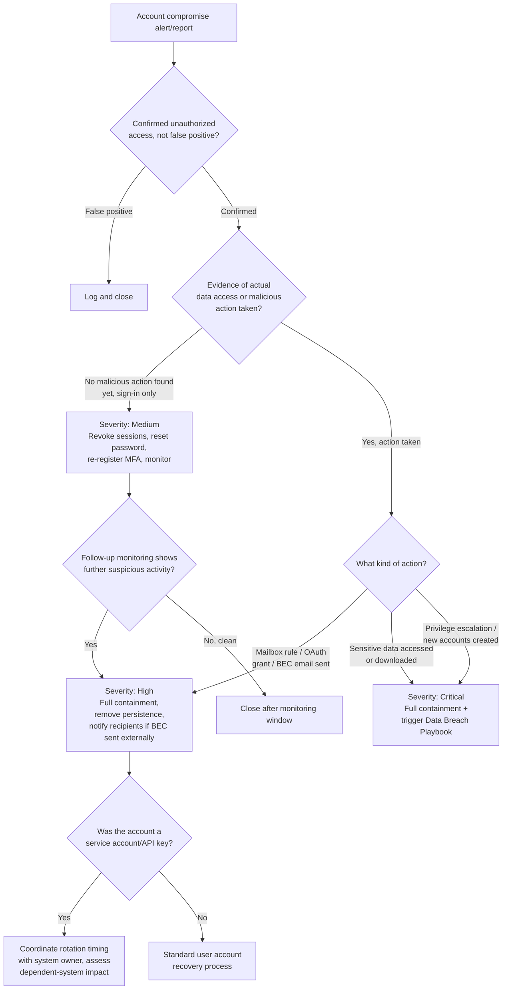

# Playbook: Account Compromise Response

**Framework alignment:** NIST SP 800-61 Rev. 2 & Rev. 3 · SANS six-phase model (see [README: Framework basis](../README.md#framework-basis))
**Playbook owner:** SOC Team
**Last reviewed:** 2026-07-11

---

## Purpose

Defines the standard procedure for triaging, containing, and recovering from a compromised user
or service account — including stolen credentials, session/token theft, impossible-travel
logins, and business email compromise (BEC). Ensures the blast radius of a compromised identity
(what it could access, what it did access) is fully scoped before the incident is closed.

## Scope

**In scope:**
- Confirmed or suspected unauthorized access to a user or service account
- Impossible-travel / anomalous-location sign-in alerts confirmed as unauthorized
- Business email compromise (attacker sending from a legitimate, compromised mailbox)
- Session/token theft (e.g. adversary-in-the-middle phishing kit stealing a live session cookie)
- Service account / API key compromise

**Out of scope (hand off to the relevant playbook instead):**
- Initial phishing vector that led to the compromise, if the email-side cleanup is still needed
  → run in parallel with **Phishing Incident Playbook**
- Malware found on the device used to access the account → **Malware Infection Playbook**
- Confirmed data access/exfiltration using the compromised account → **Data Breach Playbook**

**Systems/teams involved:** SOC (primary), IAM/Identity team (credential reset, session
revocation, conditional access), IT Helpdesk (user communication and device checks), application
owners (for any downstream system the account accessed), Legal/Compliance (if data access
occurred).

## Prerequisites

- Access to identity provider admin console (Entra ID/Okta/Google Workspace) — sign-in logs,
  session/token revocation, MFA management, conditional access policy management
- Access to SIEM for correlating the account's activity across all connected systems, not just
  the identity provider
- Access to mailbox audit logs (for email accounts) — inbox rules, delegate access, OAuth app
  grants, sent-item history
- Access to endpoint EDR for the device(s) the account signed in from
- Documented list of what each account/role has access to (least-privilege mapping), so scope
  assessment doesn't require manually discovering entitlements mid-incident
- Ability to force password reset, revoke all sessions/refresh tokens, and require MFA
  re-registration in one coordinated action

## Detection Criteria

An event qualifies as an account compromise requiring this playbook when **any** of the
following are true:

- Identity provider flags impossible travel (sign-ins from geographically incompatible locations
  within an implausible timeframe)
- Sign-in from a known-malicious IP/known threat-actor infrastructure (threat intel match)
- MFA fatigue/push-bombing pattern detected (repeated MFA prompts in a short window)
- New, unexplained mailbox rule created (especially auto-forward-and-delete rules)
- New, unexplained OAuth application granted access to the account
- User reports they did not perform an action shown in their sign-in history / sent items
- Anomalous data access pattern for that identity (mass downloads, access to resources outside
  normal role/behavior baseline) flagged by UEBA/SIEM
- Credential appears in a breach-data feed / dark-web monitoring alert **and** shows subsequent
  sign-in activity (a bare breach-data match with no sign-in activity is Low severity — see
  decision tree)

## Response Steps (by SANS Phase)

### 1. Preparation
- Maintain conditional access policies (location/device/risk-based) so anomalous sign-ins are
  blocked or challenged automatically before an analyst ever sees them
- Maintain an up-to-date, single-action "compromise response" capability in the identity provider
  (reset password + revoke all sessions + require MFA re-registration as one coordinated action,
  not three separate manual steps under pressure)
- Maintain dark-web/breach-data monitoring so leaked credentials are known before they're used
- Maintain least-privilege access mapping so "what could this account reach" is answerable in
  minutes, not hours

### 2. Identification
1. Acknowledge the alert within SLA.
2. Pull the full sign-in history for the account: timestamps, source IPs, locations, devices,
   applications accessed, success/failure status, MFA method used.
3. Determine whether the flagged activity is genuinely anomalous or a false positive (e.g.
   legitimate travel, new device the user forgot to register, VPN exit-node location shift).
   Contact the user directly to confirm — do not assume compromise without checking, but also
   don't let "waiting to confirm" delay containment if other indicators are strong.
4. If email account: check for new/modified inbox rules, delegate access grants, and OAuth app
   consents — these are the most common post-compromise persistence mechanisms and are often
   missed if the analyst only looks at sign-in logs.
5. Determine what the account had access to and correlate against actual access logs for that
   period: did the account access anything unusual, download data, send emails, modify
   permissions, or reach into other systems (SSO-linked apps, shared drives, admin consoles)?
6. Determine if this is a user account or a service account/API key — service account
   compromise often has broader, less-monitored access and needs its own scoping (what
   automation/integration depends on this credential, and what breaks if it's rotated
   immediately vs. on a maintenance window).
7. Assign severity per the [repo-wide severity matrix](../README.md#severity-matrix-used-consistently-across-all-five-playbooks).

### 3. Containment
1. **Revoke all active sessions and refresh tokens immediately** — a password reset alone does
   not invalidate already-issued session tokens; both must happen together.
2. Force a password reset and require MFA re-registration.
3. If MFA fatigue/push-bombing was the vector, review and tighten the MFA method (move to
   number-matching/FIDO2 if still on simple push-approve).
4. Suspend the account entirely if active malicious use is ongoing and immediate reset isn't fast
   enough to stop it (e.g. mass email send in progress).
5. Remove any malicious inbox rules, delegate grants, or OAuth app consents found during
   identification.
6. For service accounts: rotate the credential/API key. Coordinate timing with the
   application/system owner only if there's no active malicious use in progress — if there is,
   rotate immediately and handle any resulting outage as a lower priority than continued
   compromise.
7. Block the source IP(s) used for unauthorized access at the identity provider / conditional
   access policy if they're not shared infrastructure (VPN/proxy) that would also block
   legitimate users.

### 4. Eradication
1. Confirm no residual persistence remains: re-check for mailbox rules, OAuth grants, delegate
   access, and any newly-created accounts/service principals the compromised identity may have
   created (privilege-escalation follow-on).
2. If the compromise originated from a specific device (malware, stolen session), ensure that
   device is addressed via the **Malware Infection Playbook** before considering the identity
   side fully closed — a clean password reset doesn't help if the device is still compromised
   and will just steal the new credential too.
3. Review and revoke any downstream access the account may have granted to others (shared files,
   delegated permissions) if not already covered by session/token revocation.

### 5. Recovery
1. Re-enable the account only after password reset, MFA re-registration, and removal of any
   attacker-created persistence are all confirmed complete.
2. Notify the user of the new credential process and any behavior change (e.g. new MFA method).
3. Monitor the account's sign-in activity closely for 7–14 days post-incident.
4. If the account is tied to any automation/integration (service account), confirm the
   dependent systems are functioning correctly with the rotated credential.

### 6. Lessons Learned
- See [Post-Incident Activities](#post-incident-activities) below.

## Decision Tree

## Escalation Procedures

| Trigger | Escalate to | Timing |
|---|---|---|
| Sensitive/regulated data accessed | CISO + Legal/Compliance | Immediate — trigger Data Breach Playbook |
| Executive/VIP or privileged (admin) account compromised | SOC Lead + CISO | Immediate |
| BEC email sent to external parties (customers/partners) | SOC Lead + Legal + Communications/PR | Immediate |
| Service account with broad system access compromised | SOC Lead + affected system owners | Immediate |
| Evidence of privilege escalation / new account creation | CISO | Immediate |
| Standard single-user compromise, contained quickly | SOC Lead | Within 30 minutes |

**Escalation path:** Analyst → SOC Lead → IT Security Manager → CISO. Data access, privilege
escalation, and external-facing BEC all skip straight to CISO/Legal — don't wait for sequential
sign-off when scope already indicates breach-level impact.

## Evidence Collection

Preserve the following before remediation actions overwrite the evidence (session revocation
itself is safe to do immediately — it doesn't destroy logs — but act quickly on logging/export
since many identity providers only retain detailed sign-in logs for a limited window):

- [ ] Full sign-in log export for the account (timestamps, IPs, locations, devices, MFA method,
      success/failure) covering from well before the suspected compromise window through
      remediation
- [ ] Screenshots/exports of any malicious inbox rules, delegate grants, or OAuth app consents
      found, before removal
- [ ] List of all resources/systems the account accessed during the suspected compromise window,
      with what was accessed (file names, email subjects sent, records viewed) where available
- [ ] Any sent items, especially for BEC — what was sent, to whom, content summary
- [ ] Threat intel correlation notes (was the source IP/infrastructure previously known-malicious)
- [ ] Timeline: initial compromise vector (if known) → first unauthorized sign-in → actions taken
      → detection → containment
- [ ] User interview notes if the user reported it themselves (what they noticed, when)

Maintain chain of custody per the [Chain-of-Custody Template](../templates/chain-of-custody-template.md)
whenever the incident may involve an insider threat angle, external threat actor referral, or
data implicated for a regulatory notification.

## Recovery Actions

1. Confirm password reset, session/token revocation, and MFA re-registration all complete.
2. Confirm all attacker-created persistence (rules/grants/accounts) removed.
3. Re-enable the account and notify the user.
4. For service accounts, confirm dependent systems function correctly post-rotation.
5. Extended monitoring window (7–14 days) on the account's activity.
6. Confirm with any downstream system owners that no lingering unauthorized access remains.

## Communication Templates

See the [Stakeholder Notification Template](../templates/stakeholder-notification-template.md)
for the general format. Account-compromise-specific notification quick-reference:

**To the affected user:**
> Subject: Your account has been secured following suspicious activity
>
> We detected unauthorized activity on your account on [date/time] and have reset your password
> and revoked active sessions as a precaution. Please set a new password via [process] and
> re-register your MFA method. If you notice anything you didn't do (emails sent, files
> accessed, settings changed), reply to this message immediately.

**To external recipients of a BEC email (if sent):**
> Subject: Please disregard a recent email from [compromised address]
>
> We recently identified that [name]'s account was compromised and used to send unauthorized
> messages, including one you may have received on [date] regarding [subject]. Please disregard
> that message and do not act on any payment/data requests within it. Contact us directly at
> [verified contact] to confirm any communication going forward.

## Post-Incident Activities

- [ ] Complete the [Post-Incident Review Template](../templates/post-incident-review-template.md)
      within 5 business days of closure
- [ ] Add confirmed malicious IPs/infrastructure to threat intel feed and conditional access
      blocklists
- [ ] Review whether MFA method needs strengthening organization-wide (e.g. move away from
      simple push-approval if push-bombing was the vector)
- [ ] Review conditional access policies for gaps that allowed the initial sign-in through
- [ ] If BEC was sent externally, coordinate with Communications/PR on any needed customer/partner
      follow-up beyond the direct notification
- [ ] Cross-reference with the initial compromise vector's playbook (phishing/malware) to ensure
      that side of the incident is also fully closed, not just the identity side
