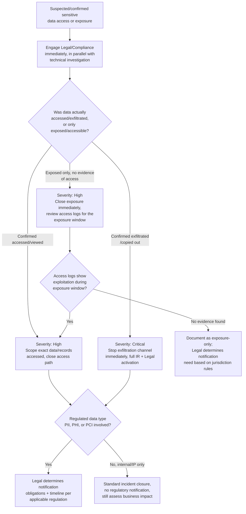

# Playbook: Data Breach Response

**Framework alignment:** NIST SP 800-61 Rev. 2 & Rev. 3 · SANS six-phase model · GDPR Article 33 (72-hour notification requirement)
**Playbook owner:** SOC Team (technical response) / Legal & Compliance (regulatory/notification)
**Last reviewed:** 2026-07-11

---

## Purpose

Defines the standard procedure for responding to confirmed or suspected unauthorized access to,
or exfiltration of, sensitive data — including customer PII, employee PII, PHI, PCI cardholder
data, intellectual property, or other regulated/confidential information. This playbook covers
the **technical containment and investigation** side; regulatory notification timelines and
legal obligations are coordinated jointly with Legal/Compliance and are noted throughout but not
a substitute for legal counsel's own process.

## Scope

**In scope:**
- Confirmed unauthorized access to systems/databases containing sensitive data
- Confirmed or suspected data exfiltration (outbound transfer of sensitive data to
  unauthorized destinations)
- Misconfigured access controls discovered to have exposed sensitive data (e.g. public cloud
  storage bucket, unsecured database, overly broad file-share permissions) — even without
  confirmed malicious access, exposure itself may trigger notification obligations
- Insider-driven unauthorized data access or exfiltration

**Out of scope (hand off to the relevant playbook instead, run in parallel):**
- The initial compromise vector (phishing/malware/account compromise) that led to the breach —
  those playbooks' containment/eradication steps still apply to the source of the breach
- This playbook picks up specifically at "sensitive data was accessed or may leave the
  environment" — treat it as almost always running **in parallel** with one of the other four
  playbooks, not standalone

**Systems/teams involved:** SOC (technical investigation), CISO (incident command), Legal/
Compliance (regulatory obligations, notification requirements, litigation hold), Privacy Officer
(if PII/PHI involved), Communications/PR (public and customer-facing statements), executive
leadership (Critical-severity incidents), potentially external forensics/breach-coach counsel and
law enforcement.

## Prerequisites

- Data classification inventory: know where regulated/sensitive data lives *before* an incident,
  so scope assessment doesn't start with "where is this data even stored"
- DLP (Data Loss Prevention) tooling access and alert history
- Network monitoring/proxy logs capable of showing outbound data transfer volume and destination
- Database/file-share access logs (who accessed what, when) with sufficient retention
- Legal/Compliance contact on-call for immediate engagement — regulatory notification clocks
  (e.g. 72-hour GDPR requirement) can start ticking from the moment of *awareness*, not
  confirmation, so Legal needs to be looped in early, not after technical certainty
- Cyber insurance policy contact/breach-coach relationship, if applicable, engaged early — many
  policies require notification within a specific window and may dictate approved forensics
  vendors

## Detection Criteria

An event qualifies as a data breach requiring this playbook when **any** of the following are
true:

- DLP alert confirms sensitive data left the environment via an unauthorized channel (email,
  upload, USB, cloud sync)
- Network monitoring shows anomalous large-volume outbound transfer from a system known to hold
  sensitive data, to an unfamiliar/unauthorized destination
- Confirmed account or system compromise (from another playbook) had access to sensitive data
  during the compromise window
- A misconfigured access control is discovered exposing sensitive data externally (even with no
  confirmed access — public bucket, exposed database, indexed-by-search-engine sensitive
  document)
- Third-party notification (customer, partner, researcher, or the data appearing for sale/leak
  online) that your data is exposed
- Insider report or investigation revealing unauthorized access/exfiltration by an employee or
  contractor

## Response Steps (by SANS Phase)

### 1. Preparation
- Maintain the data classification inventory and keep it current as new systems/data stores are
  added
- Maintain DLP coverage on the highest-sensitivity data stores and egress points
- Maintain a pre-established relationship with Legal/Compliance for rapid engagement, and with a
  breach-coach/forensics firm if the organization doesn't have deep in-house forensics capacity
- Maintain a communication/notification template set pre-approved by Legal so the first
  notification doesn't have to be drafted from scratch under time pressure

### 2. Identification
1. Acknowledge the trigger within SLA — **for any suspected regulated-data exposure, engage
   Legal/Compliance immediately in parallel with technical investigation, don't wait for
   technical confirmation first.** Notification clocks in many regulations start from awareness.
2. Confirm what data was actually accessible/accessed: exact data types (names, SSNs, card
   numbers, health records, credentials, IP, etc.), record count/volume, and time window of
   exposure or access.
3. Confirm whether data was merely *accessed* (viewed) vs. actually *exfiltrated* (copied/
   transferred out) — this materially changes both severity and notification obligations in most
   frameworks.
4. Identify affected individuals/entities (customers, employees, partners) and their
   jurisdictions — different regulations (GDPR, CCPA, HIPAA, state breach-notification laws,
   sector-specific rules) apply based on whose data and where they're located, which Legal must
   determine.
5. Determine the access/exfiltration method and correlate with the originating playbook
   (compromised account, malware, misconfiguration) to understand full attack path.
6. Determine if data is confirmed to be for sale/publicly posted (dark web, leak site,
   paste site) — this changes urgency and may itself be the detection trigger.
7. Assign severity per the [repo-wide severity matrix](../README.md#severity-matrix-used-consistently-across-all-five-playbooks)
   — most confirmed data breach scenarios default to **High or Critical** regardless of volume,
   given legal/regulatory exposure.

### 3. Containment
1. Close the access/exfiltration path immediately: revoke the compromised account's access, fix
   the misconfigured control, block the exfiltration channel/destination — coordinated with
   whichever originating playbook (account compromise/malware/phishing) is also running.
2. If data is actively being exfiltrated (ongoing transfer), prioritize stopping the transfer
   over preserving a live connection for monitoring purposes — stop the bleeding first.
3. If a misconfiguration caused public exposure (e.g. public cloud bucket), correct the
   configuration immediately and confirm no external access logs show the exposure window was
   exploited beyond what's already known.
4. Preserve, don't delete: ensure containment actions (revoking access, closing the bucket) do
   not destroy access logs or other evidence needed for scope determination.
5. If insider-driven, coordinate with HR and Legal before taking any employee-facing action —
   this has legal/employment-law implications beyond the technical response.

### 4. Eradication
1. Complete eradication steps from the originating playbook (malware removal, account
   remediation, etc.) — this playbook does not duplicate those, only tracks that they're done.
2. Confirm the root cause (vulnerability, misconfiguration, compromised credential) is fully
   closed, not just the immediate access path.
3. Review for any other systems/data that may have been exposed by the same root cause
   (e.g. if one misconfigured bucket was found, check for sibling buckets with the same
   misconfiguration pattern).

### 5. Recovery
1. Confirm with Legal/Compliance whether and when regulatory notifications are required, and to
   whom (regulators, affected individuals, partners) — this is Legal's determination, not SOC's,
   but SOC provides the technical facts (what data, how many records, confirmed access vs.
   exposure only, timeline) that Legal needs to make it.
2. Support drafting of notification content with accurate technical detail once Legal determines
   notification is required.
3. Restore normal operations for any systems taken offline during containment.
4. Monitor for continued/renewed unauthorized access attempts against the same
   data/systems for an extended period (30+ days is common for high-value data breaches).

### 6. Lessons Learned
- See [Post-Incident Activities](#post-incident-activities) below.

## Decision Tree

## Escalation Procedures

| Trigger | Escalate to | Timing |
|---|---|---|
| Any suspected regulated data (PII/PHI/PCI) exposure/access | CISO + Legal/Compliance + Privacy Officer | Immediate |
| Confirmed exfiltration of any sensitive data | CISO + Legal + Executive leadership | Immediate |
| Data found for sale/posted publicly | CISO + Legal + Communications/PR | Immediate |
| Insider-driven breach | CISO + Legal + HR | Immediate |
| Third-party (customer/partner/researcher) notification of exposure | CISO + Legal + Communications/PR | Immediate |
| Misconfiguration exposure with no evidence of access | SOC Lead + Legal (for determination) | Within 1 hour |

**Escalation path:** Analyst → SOC Lead → CISO + Legal/Compliance (simultaneously, not
sequentially) → Executive leadership for Critical severity. This playbook has the shortest
escalation path of the five — data breach response is inherently a joint technical/legal/
executive function from the start, not a technical-first process with legal added later.

## Evidence Collection

Preserve the following — data breach evidence requirements are typically the strictest of the
five playbooks given regulatory/legal proceedings that often follow:

- [ ] Complete access logs for the affected data store covering well before and after the
      suspected incident window
- [ ] Exact data schema/fields accessed (what data types, not just "a database") and record
      count
- [ ] List of affected individuals/entities, with enough detail (jurisdiction) for Legal to
      determine applicable notification law
- [ ] Network logs showing any outbound transfer: destination, volume, protocol, timestamps
- [ ] Timeline: how access was gained (link to originating playbook's evidence) → what was
      accessed/exfiltrated → when detected → when contained
- [ ] Evidence of the root cause (misconfiguration screenshot/config export, compromised
      credential details, malware sample — cross-referenced from the originating playbook)
- [ ] Any external evidence of exposure (leak site posting, dark web listing, researcher report)
      preserved as screenshots/archived copies
- [ ] All communications with Legal/Compliance and any external forensics/breach-coach engaged,
      maintained separately for privilege considerations (coordinate with Legal on this — some
      jurisdictions treat breach investigation materials as privileged if properly structured)

Maintain chain of custody per the [Chain-of-Custody Template](../templates/chain-of-custody-template.md)
for all evidence — data breach investigations are the most likely of the five incident types to
involve regulatory inquiry, litigation, or law enforcement referral, making defensible evidence
handling non-optional.

## Recovery Actions

1. Confirm the access/exfiltration path is fully closed (verified by the originating playbook's
   eradication steps).
2. Confirm no sibling systems share the same root-cause vulnerability/misconfiguration.
3. Complete any Legal-determined notifications on the required timeline.
4. Restore normal operations for any systems taken offline.
5. Extended monitoring (30+ days) for renewed access attempts against the same data/systems.
6. Confirm with data/system owners that access controls are verified correctly configured
   going forward, not just patched for this instance.

## Communication Templates

See the [Stakeholder Notification Template](../templates/stakeholder-notification-template.md)
for the general format. **All external/customer/regulatory communication for a data breach must
be reviewed and approved by Legal/Compliance before sending — the templates below are technical
starting points, not approved-for-send copy.**

**Internal — to executive leadership (initial notification):**
> Subject: CRITICAL — data exposure incident, Legal/Compliance engaged
>
> We've identified [exposure/access/exfiltration] of [data type] affecting an estimated [N]
> records/individuals, detected at [time]. Containment [in progress/complete]. Legal and
> Compliance are engaged to determine notification obligations. Technical investigation ongoing.
> Next update by [time].

**Draft starting point for external notification (Legal must finalize):**
> Subject: Notice of data incident
>
> We are writing to inform you of a data security incident that may have involved your
> [information type]. On [date], we discovered [brief factual description]. We have taken steps
> to [containment action] and are conducting a full investigation. [Recommended actions for the
> recipient, e.g. credit monitoring offer, password reset]. For questions, contact [dedicated
> contact/hotline].

## Post-Incident Activities

- [ ] Complete the [Post-Incident Review Template](../templates/post-incident-review-template.md)
      within 5 business days of technical closure (regulatory/legal process may extend well
      beyond this — track separately)
- [ ] Confirm all Legal-required notifications were sent within applicable deadlines, with proof
      of delivery retained
- [ ] Review data classification/access-control coverage for gaps revealed by this incident
- [ ] Review DLP rule coverage — did existing rules catch this, or is a new rule needed
- [ ] Cross-reference with the originating playbook's post-incident activities (phishing/
      malware/account compromise) to ensure root-cause remediation is tracked there, not
      duplicated here
- [ ] If cyber insurance was engaged, complete any required claim documentation
- [ ] Board/executive-level incident summary if required by governance policy for Critical
      severity breaches
