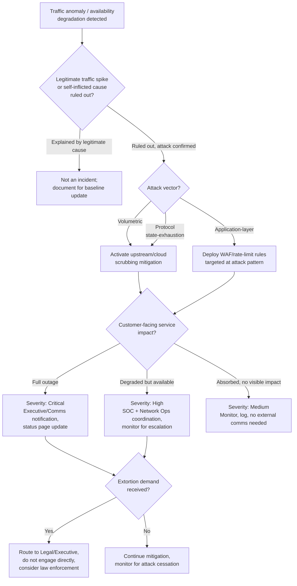

# Playbook: DDoS Attack Response

**Framework alignment:** NIST SP 800-61 Rev. 2 · SANS six-phase model
**Playbook owner:** SOC Team (technical response) / Network Operations (mitigation execution)
**Last reviewed:** 2026-07-11

---

## Purpose

Defines the standard procedure for detecting, mitigating, and recovering from a distributed
denial-of-service (DDoS) attack — volumetric (bandwidth exhaustion), protocol (state-table
exhaustion), and application-layer (targeted service/API abuse) variants. Unlike the other four
playbooks, DDoS response is primarily an **availability** incident, not a confidentiality/
integrity one — the priority order and tooling differ accordingly.

## Scope

**In scope:**
- Volumetric attacks (UDP floods, amplification/reflection attacks, large-scale SYN floods)
  saturating network bandwidth
- Protocol attacks (SYN floods, fragmented packet attacks) exhausting server/firewall/load
  balancer connection-state tables
- Application-layer attacks (HTTP floods, targeted API abuse, Slowloris-style slow connection
  exhaustion) degrading a specific service without necessarily saturating bandwidth
- Multi-vector attacks combining the above

**Out of scope (hand off to the relevant playbook instead):**
- DDoS used as a smokescreen for a simultaneous intrusion attempt elsewhere in the environment —
  if evidence of a parallel intrusion emerges, run the relevant playbook (malware/account
  compromise/data breach) **in parallel**, don't let DDoS mitigation consume all attention if
  something else is happening underneath it
- Legitimate traffic spikes (e.g. viral marketing event, flash sale) mistaken for an attack —
  confirm attack characteristics before treating as an incident (see Detection Criteria)

**Systems/teams involved:** SOC (detection/coordination), Network Operations (mitigation
execution — firewall/scrubbing/CDN configuration), hosting/cloud provider or DDoS mitigation
vendor (for volumetric attacks beyond on-premise capacity), Communications (customer-facing
status updates if the outage is customer-visible), executive leadership (for prolonged or
high-impact outages).

## Prerequisites

- Contracted DDoS mitigation service (cloud-based scrubbing, CDN with DDoS protection, or ISP-
  level mitigation) with an activation process the team can execute without a lengthy
  procurement/approval delay during an active attack
- Network monitoring with real-time traffic visibility (NetFlow/sFlow, load balancer metrics,
  firewall connection-state metrics) to distinguish attack traffic from legitimate load
  fluctuation
- Baseline traffic patterns documented (normal peak volume, normal connection rates) so
  "abnormal" has a concrete reference point
- Pre-configured rate-limiting/geo-blocking/WAF rules ready to deploy quickly, rather than
  written from scratch mid-attack
- Status page / customer communication mechanism that doesn't depend on the infrastructure being
  attacked (i.e. don't host your status page on the same infrastructure you'd need to declare an
  outage on)
- Direct contact (not just a support ticket queue) with the ISP/hosting provider/mitigation
  vendor for emergency escalation

## Detection Criteria

An event qualifies as a DDoS attack requiring this playbook when **any** of the following are
true, **and** legitimate-traffic explanations have been ruled out:

- Sustained traffic volume significantly exceeding documented baseline peak, with no known
  legitimate driver (marketing campaign, product launch, seasonal pattern)
- Connection/session table exhaustion on firewalls/load balancers with source IP diversity
  inconsistent with organic traffic (many-to-one from a wide, often spoofed or botnet-sourced,
  IP range)
- Service degradation/unavailability correlating with anomalous request patterns to a specific
  endpoint (application-layer indicator) — e.g. a single API endpoint receiving disproportionate
  request volume from many sources
- Amplification-attack signatures (large response-to-request ratio traffic from DNS/NTP/memcached
  reflection sources) inbound at high volume
- Direct notification from ISP/hosting provider of anomalous traffic destined for your
  infrastructure
- Extortion communication received threatening or claiming responsibility for an attack

**Explicitly rule out first:** legitimate viral traffic spike, misconfigured internal
job/scraper causing self-inflicted load, upstream ISP/provider outage unrelated to attack traffic.

## Response Steps (by SANS Phase)

### 1. Preparation
- Maintain an active DDoS mitigation service contract/capability, tested at least annually with
  a controlled simulation
- Maintain current network traffic baselines, refreshed as normal business traffic patterns
  change (e.g. after a major product launch permanently raises baseline volume)
- Maintain pre-built mitigation rule sets (rate limits, geo-blocks, known-bad ASN blocks) ready
  for rapid deployment
- Maintain an out-of-band communication channel for the response team that doesn't depend on
  potentially-attacked infrastructure (e.g. a phone bridge/separate chat tool, not only the
  corporate network's own messaging system if that's hosted on affected infrastructure)

### 2. Identification
1. Acknowledge the alert within SLA — availability incidents have low tolerance for delay since
   impact (and often revenue/reputation impact) accrues continuously while unmitigated.
2. Confirm attack characteristics against network monitoring: volume, source IP diversity/
   distribution, targeted port/protocol/endpoint, and whether it matches a known attack pattern
   (volumetric/protocol/application-layer).
3. Rule out legitimate-traffic and self-inflicted explanations (see Detection Criteria) before
   committing to full DDoS response — misapplying aggressive mitigation to legitimate traffic
   causes a self-inflicted outage on top of (or instead of) the real one.
4. Determine attack vector classification (volumetric/protocol/application-layer/multi-vector) —
   this determines which mitigation layer (network-level scrubbing vs. WAF/rate-limiting) is
   effective; applying the wrong layer wastes critical response time.
5. Determine business impact: which services are degraded/unavailable, and what's the actual
   customer/revenue impact — this drives both severity and communication urgency.
6. Check for extortion communication or claimed responsibility — this may indicate a
   ransom-DDoS pattern where the attack could resume/escalate if demands aren't met, and law
   enforcement notification is often warranted regardless of payment decision (payment is not
   recommended and should be a Legal/executive decision, not a technical one).
7. Assign severity per the [repo-wide severity matrix](../README.md#severity-matrix-used-consistently-across-all-five-playbooks) —
   base this on actual business/customer impact, not raw traffic volume alone (a large attack
   fully absorbed by mitigation with zero customer impact may rate lower than a smaller attack
   that takes a customer-facing service fully offline).

### 3. Containment
1. Activate DDoS mitigation service (scrubbing center/CDN protection) for volumetric/protocol
   attacks — redirect traffic through the mitigation provider per the pre-established activation
   process.
2. Deploy rate-limiting, geo-blocking, or WAF rules targeted at the specific attack pattern for
   application-layer attacks — avoid blunt instruments (blocking entire countries/ASNs) unless
   the attack traffic is cleanly distinguishable that way without significant legitimate-user
   impact.
3. For reflection/amplification attacks, coordinate with the ISP for upstream filtering — this
   traffic often can't be effectively filtered at your own network edge since it arrives already
   at full volume.
4. Communicate status internally immediately: services affected, mitigation status, ETA if
   known — availability incidents generate business-side urgency fast, get ahead of it with
   information rather than let confusion drive escalation.
5. If extortion demand received, do not engage/negotiate directly — route to Legal/executive
   leadership for decision, and preserve the communication as evidence.

### 4. Eradication
- DDoS attacks don't have a traditional "eradication" step (there's no malware/persistence to
  remove) — this phase instead means **confirming the attack has actually stopped**, not just
  that mitigation is currently absorbing it, and identifying whether the attacker will likely
  return (common with extortion-driven or grudge attacks).
1. Confirm attack traffic has genuinely ceased (not just mitigated) by checking upstream volume
   at the network edge, not just service-level availability (mitigation can mask an ongoing
   attack from users while it's still hitting your edge).
2. Review whether the attack revealed an unprotected vector (e.g. an API endpoint without rate
   limiting that a WAF rule now covers) and confirm the fix is durable, not just a temporary
   block that will need re-applying.

### 5. Recovery
1. Gradually reduce/remove emergency mitigation measures (aggressive rate limits, geo-blocks)
   only after confirming attack traffic has stopped, to avoid impacting legitimate users
   unnecessarily long after the attack ends.
2. Confirm all affected services are fully restored to normal performance, not just
   "technically up."
3. Monitor traffic closely for attack resumption for an extended window (particularly important
   for extortion-pattern attacks, which often resume if demands aren't met, or resume against a
   different vector after the first is mitigated).
4. Update customer-facing status page to "resolved" only after sustained confirmation, not at
   the first sign of traffic normalization.

### 6. Lessons Learned
- See [Post-Incident Activities](#post-incident-activities) below.

## Decision Tree

## Escalation Procedures

| Trigger | Escalate to | Timing |
|---|---|---|
| Full customer-facing service outage | CISO + IT Leadership + Communications/PR | Immediate |
| Extortion demand received | CISO + Legal + Executive leadership | Immediate |
| Attack exceeds current mitigation capacity | Network Ops Lead + hosting/mitigation vendor escalation | Immediate |
| Suspected DDoS-as-smokescreen for parallel intrusion | CISO — activate relevant secondary playbook | Immediate |
| Degraded-but-available, mitigation effective | SOC Lead + Network Ops | Within 30 minutes |
| Attack fully absorbed with no visible impact | SOC Lead | Within 2 hours (log and monitor) |

**Escalation path:** Analyst → SOC Lead → Network Operations Lead (for mitigation execution,
runs in parallel with SOC investigation) → CISO for Critical severity or any extortion
communication. Availability incidents with visible customer impact should reach Communications/
PR quickly regardless of technical severity, since customer/public perception accrues in
real time during an outage.

## Evidence Collection

DDoS evidence collection is lighter than the other four playbooks (no host/account forensics
typically needed) but still valuable for post-incident analysis, vendor claims, and potential law
enforcement referral (especially for extortion-pattern attacks):

- [ ] Traffic capture/NetFlow data showing attack characteristics: volume over time, source IP
      distribution, targeted ports/protocols/endpoints
- [ ] Mitigation provider's attack report/dashboard export, if using a third-party scrubbing
      service
- [ ] Timeline: detection → mitigation activation → attack cessation → recovery
- [ ] Any extortion communication received, preserved with full headers/metadata
- [ ] Business impact record: which services were affected, duration, estimated customer/
      revenue impact
- [ ] Screenshots of status page updates and internal communications timeline for the
      post-incident review

## Recovery Actions

1. Confirm attack traffic has genuinely ceased at the network edge.
2. Gradually roll back emergency mitigation measures, monitoring for legitimate-user impact.
3. Confirm full service restoration and normal performance.
4. Update status page to resolved after sustained confirmation.
5. Extended monitoring window for attack resumption, especially for extortion-pattern incidents.
6. Confirm any newly-added durable protections (WAF rules, rate limits) remain in place as
   permanent hardening, not just emergency measures to be removed.

## Communication Templates

See the [Stakeholder Notification Template](../templates/stakeholder-notification-template.md)
for the general format. DDoS-specific notification quick-reference:

**Status page (during active incident):**
> We are currently experiencing a distributed denial-of-service attack affecting [service name].
> Our team is actively mitigating and working to restore full service. We'll update this page as
> the situation develops. [Timestamp]

**Status page (resolved):**
> The service disruption affecting [service name] has been resolved as of [time]. The issue was
> caused by a denial-of-service attack, which has been mitigated. We're continuing to monitor
> closely. We apologize for any inconvenience.

**Internal — to executive leadership (active Critical incident):**
> Subject: CRITICAL — active DDoS attack, [service] outage
>
> [Service] is currently [degraded/unavailable] due to an active DDoS attack detected at [time].
> Mitigation via [scrubbing provider/WAF rules] is [in progress/active]. Estimated customer
> impact: [description]. Next update in 30 minutes or upon material change.

## Post-Incident Activities

- [ ] Complete the [Post-Incident Review Template](../templates/post-incident-review-template.md)
      within 5 business days of closure
- [ ] Review whether mitigation activation time met target SLA — if not, identify the delay
      (contract activation friction, unclear internal process, tooling gap) and fix it
- [ ] Update traffic baselines if the business has genuinely grown past the previous baseline
      (avoids future false-negative "this looks normal" assessments)
- [ ] Review whether any newly-discovered unprotected vector (e.g. rate-limit gap on a specific
      API) needs permanent hardening beyond the emergency mitigation rule
- [ ] If extortion-pattern, coordinate with Legal on law enforcement referral regardless of
      whether a demand was paid (it should not have been, absent an explicit executive/legal
      decision otherwise)
- [ ] Review mitigation vendor/contract capacity against the observed attack size — upgrade
      capacity if the attack approached or exceeded contracted mitigation limits
