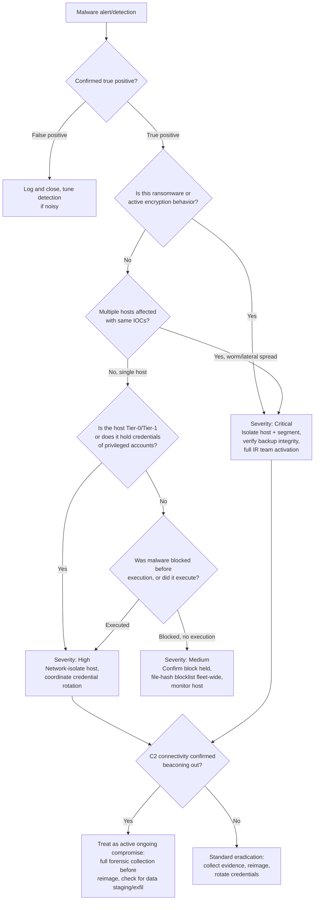

# Playbook: Malware Infection Response

**Framework alignment:** NIST SP 800-61 Rev. 2 & Rev. 3 · SANS six-phase model · [NIST SP 800-83 Rev. 1](https://csrc.nist.gov/pubs/sp/800/83/r1/final) (malware-specific) · CISA [#StopRansomware Guide](https://www.cisa.gov/stopransomware/ransomware-guide)
**Playbook owner:** SOC Team
**Last reviewed:** 2026-07-11

---

## Purpose

Defines the standard procedure for triaging, containing, eradicating, and recovering from a
malware infection on an endpoint or server — including trojans, worms, ransomware, infostealers,
and living-off-the-land toolkits. Ensures containment happens fast enough to prevent lateral
spread while preserving enough evidence to understand scope and root cause.

## Scope

**In scope:**
- AV/EDR alerts indicating malware execution, blocked, or quarantined
- Ransomware detonation (encryption activity, ransom note deployment)
- User/helpdesk reports of unusual system behavior later confirmed as malware
- C2 beacon activity detected via network monitoring (Zeek/IDS/proxy logs) tied to a specific host

**Out of scope (hand off to the relevant playbook instead):**
- Malware delivered via phishing where the email-side cleanup is still needed → run in parallel
  with **Phishing Incident Playbook**
- Confirmed data exfiltration by the malware → **Data Breach Playbook**
- Credential theft by an infostealer with evidence of account use elsewhere → **Account
  Compromise Playbook**

**Systems/teams involved:** SOC (primary), Endpoint/IT Operations (isolation, reimaging), Network
team (segmentation, firewall blocks), IAM (credential resets if infostealer involved),
Legal/Compliance (if ransomware or regulated-data host affected).

## Prerequisites

- EDR console access with network-isolation and process-kill capability
- Access to endpoint imaging/forensic collection tooling (e.g. KAPE, FTK Imager, Velociraptor)
- Access to SIEM for correlating the host's network activity, authentication events, and any
  lateral-movement indicators
- Malware sandboxing/reverse-engineering capability (or a documented escalation path to a vendor/
  MSSP that has it) for sample analysis
- Up-to-date asset inventory with system criticality/tier classification (Tier-0 domain
  controllers and Tier-1 servers require different handling than a standard user workstation)
- Known-good backup/recovery process for the affected system class, with tested restore
  procedure
- Threat intel access to check file hashes, C2 IPs/domains, and known malware family TTPs

## Detection Criteria

An event qualifies as a malware infection requiring this playbook when **any** of the following
are true:

- EDR/AV flags malicious file execution, whether blocked or successfully executed
- Ransom note, mass file renaming/encryption, or shadow-copy deletion activity observed
- SIEM/network monitoring identifies C2 beacon behavior (regular-interval outbound connections,
  known-bad IP/domain contact, DNS tunneling patterns) tied to a specific host
- Unusual process behavior reported: unexpected process spawning cmd.exe/powershell.exe,
  disabled security tooling, unexplained persistence mechanisms (new scheduled tasks, services,
  Run keys)
- Multiple hosts showing identical IOC patterns within a short window (worm/lateral-movement
  indicator — escalate scope assessment immediately)

## Response Steps (by SANS Phase)

### 1. Preparation
- Maintain EDR coverage across 100% of the fleet; track and remediate coverage gaps
- Maintain tested, offline/immutable backups for all Tier-0/Tier-1 systems (ransomware
  resilience)
- Maintain an isolation procedure that doesn't require physical access (network-level EDR
  isolation preferred over "unplug the cable")
- Pre-stage forensic collection tooling so it can be deployed to a host without a fresh
  installation during an active incident

### 2. Identification
1. Acknowledge the alert within SLA. Ransomware/EDR-confirmed execution is always **Critical** —
   skip severity deliberation and go straight to containment in parallel with this step.
2. Confirm the alert is a true positive: review the EDR process tree, file hash, and behavior
   (not just the signature name — check what the process actually did).
3. Identify the malware family if possible (EDR classification, VirusTotal hash lookup, sandbox
   detonation of the sample) — this determines known C2 infrastructure, known lateral-movement
   behavior, and known data-theft capability to check for.
4. Determine scope: is this isolated to one host, or are multiple hosts showing the same IOCs?
   Pivot in SIEM on the file hash, C2 IP/domain, and any process command-line strings.
5. Determine host criticality (Tier-0/1/2) — this drives both severity and containment method.
6. Check whether the malware has C2 connectivity established (beaconing) — if so, treat this as
   an active, ongoing compromise, not a static infection.
7. Assign severity per the [repo-wide severity matrix](../README.md#severity-matrix-used-consistently-across-all-five-playbooks).

### 3. Containment
1. **Isolate the host at the network layer via EDR** (not full power-off — powering off destroys
   volatile memory evidence and, for ransomware, may not stop an already-in-progress encryption
   process that continues on battery/UPS power anyway). Network isolation should still allow
   EDR agent communication for continued visibility.
2. If lateral movement or worm behavior is confirmed, isolate the affected network
   segment/VLAN, not just the single host, while scope assessment continues.
3. Block the malware's C2 IPs/domains at the firewall/proxy fleet-wide.
4. Add the file hash to the EDR blocklist fleet-wide to prevent re-execution/spread.
5. If credentials were present/usable on the infected host (common for infostealers and
   post-exploitation toolkits), treat all accounts that logged into that host as
   potentially-compromised and coordinate with IAM for credential resets — hand off to the
   **Account Compromise Playbook** for those accounts.
6. **Ransomware-specific:** confirm backup integrity for affected systems/shares *before* any
   further action that could touch backup infrastructure. Isolate backup systems from the
   affected network segment if there's any indication the ransomware actor had domain-level
   access (backups are a common secondary target).

### 4. Eradication
1. Collect forensic evidence (see below) **before** wiping or reimaging — a rebuilt host without
   evidence collection means you can never answer "how did this get in" or "what did it touch."
2. Identify and remove all persistence mechanisms: scheduled tasks, services, Run/RunOnce
   registry keys, WMI event subscriptions, startup folder items, browser extensions if relevant.
3. **Preferred remediation for any confirmed-executed malware: reimage the host from a known-good
   image**, rather than attempting in-place cleaning. In-place removal cannot guarantee every
   persistence mechanism or dropped secondary payload was found.
4. Rotate any credentials that were stored or usable on the host (local admin, cached domain
   credentials, saved browser/application passwords, API keys/service account credentials if the
   host was a server).
5. Confirm the initial infection vector is closed (e.g. if delivered via phishing, confirm the
   email-side playbook's containment steps are complete; if via an exposed/vulnerable service,
   confirm that service is patched or firewalled).

### 5. Recovery
1. Reimage/rebuild the host from a verified clean image; restore data from backups predating the
   infection where needed, with backups themselves verified clean before restore.
2. Reconnect the host to the network only after confirming: clean image, current patches, EDR
   agent active and reporting, no re-detection on a post-rebuild scan.
3. Re-enable any accounts/credentials only after rotation is confirmed complete.
4. Monitor the rebuilt host and its network segment closely for 7–14 days for reinfection or
   related lateral-movement indicators.
5. Confirm with the system/business owner that the system is fully operational and data
   integrity is verified (especially critical after a ransomware restore).

### 6. Lessons Learned
- See [Post-Incident Activities](#post-incident-activities) below.

## Decision Tree

## Escalation Procedures

| Trigger | Escalate to | Timing |
|---|---|---|
| Ransomware confirmed | CISO + IT Leadership + Legal | Immediate |
| Multiple hosts / lateral movement confirmed | SOC Lead + IT Manager + Network team | Immediate |
| Tier-0 (domain controller) or Tier-1 server affected | SOC Lead + CISO | Immediate |
| C2 connectivity confirmed active | SOC Lead | Immediate |
| Evidence of data staging/exfiltration | CISO + Legal/Compliance | Immediate — trigger Data Breach Playbook |
| Standard single-host, blocked/contained infection | SOC Lead | Within 30 minutes |

**Escalation path:** Analyst → SOC Lead → IT Security Manager → CISO → IT Leadership/Legal (for
ransomware or confirmed breach). Ransomware and multi-host lateral movement skip straight to
CISO — don't wait for sequential sign-off.

## Evidence Collection

Preserve the following **before** any remediation/reimaging step that would destroy it:

- [ ] Malware sample file (hash it first, store in an isolated/password-protected archive)
- [ ] Full EDR process tree/timeline for the infection (parent/child process chain, command
      lines, file/registry modifications)
- [ ] Memory capture of the affected host, if forensically significant (ransomware, active C2,
      unknown/novel malware) — use a memory-forensics-safe tool, don't just power-cycle
- [ ] Disk image or targeted forensic triage collection (MFT, registry hives, event logs,
      prefetch, browser history) if root-cause/scope determination requires it
- [ ] Network logs showing C2 communication: source/dest IP, port, protocol, timestamps, any
      DNS queries to the C2 domain
- [ ] List of all persistence mechanisms found, with timestamps of creation where available
- [ ] List of all credentials that were present/cached on the host
- [ ] Screenshots of any ransom note or other attacker-left artifact
- [ ] Timeline reconstruction: initial infection vector → execution → persistence →
      C2/lateral-movement/exfil activity → detection → containment

Maintain chain of custody per the [Chain-of-Custody Template](../templates/chain-of-custody-template.md)
— ransomware and confirmed breaches routinely involve law enforcement, cyber insurance claims,
and/or litigation, all of which require defensible evidence handling.

## Recovery Actions

1. Confirm forensic collection is complete before reimaging.
2. Reimage/rebuild from a verified-clean image; apply current patches before reconnecting.
3. Restore data from backups verified clean and predating the infection.
4. Confirm all credential rotations completed for accounts used on the host.
5. Reconnect to network only after EDR confirms clean state and active monitoring.
6. Extended monitoring window (7–14 days) on the rebuilt host and its network segment.
7. Confirm operational sign-off from the system/business owner.

## Communication Templates

See the [Stakeholder Notification Template](../templates/stakeholder-notification-template.md)
for the general format. Malware-specific notification quick-reference:

**To IT Leadership (ransomware, immediate):**
> Subject: CRITICAL — active ransomware incident, [hostname/segment]
>
> Ransomware activity confirmed on [host/segment] at [time]. Containment in progress: network
> isolation applied to [scope]. Backup integrity check [in progress/confirmed clean]. IR team
> activated. Next update in 30 minutes or upon material change.

**To affected business unit (standard containment):**
> Subject: Security maintenance — [hostname] temporarily offline
>
> [Hostname] has been taken offline as a precaution following a security detection. We expect it
> back online by [ETA]. No action needed from your team unless contacted directly. Contact [SOC
> contact] with any questions.

## Post-Incident Activities

- [ ] Complete the [Post-Incident Review Template](../templates/post-incident-review-template.md)
      within 5 business days of closure (immediately for Critical/ransomware incidents — don't
      wait the full window)
- [ ] Add confirmed IOCs (hashes, C2 IPs/domains) to the internal threat intel feed and EDR
      blocklist if not already fleet-wide
- [ ] Review and close the initial infection vector if it revealed a broader gap (unpatched
      service, missing EDR coverage, phishing gap — cross-reference other playbooks as needed)
- [ ] Review backup/recovery process effectiveness if a restore was required — document actual
      recovery time vs. target RTO
- [ ] Update detection rules/EDR policy if the infection revealed a detection gap
- [ ] For ransomware: complete any required regulatory/insurance notifications per Legal's
      guidance, separate from the technical post-incident review
