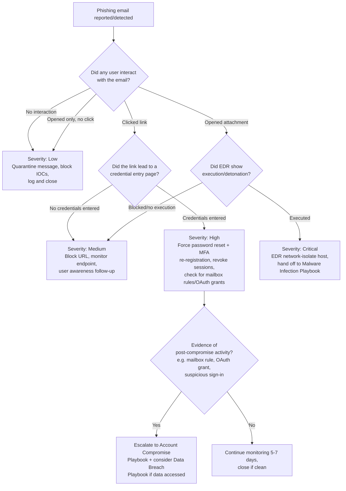

# Playbook: Phishing Incident Response

**Framework alignment:** NIST SP 800-61 Rev. 2 · SANS six-phase model
**Playbook owner:** SOC Team
**Last reviewed:** 2026-07-11

---

## Purpose

Defines the standard procedure for triaging, investigating, containing, and closing out any
reported or detected phishing email — including credential-harvesting links, malicious
attachments, and business email compromise (BEC) lures. Ensures every phishing report gets a
consistent, time-bound response regardless of which analyst picks it up.

## Scope

**In scope:**
- Emails reported via the "Report Phishing" button or forwarded to the SOC/abuse mailbox
- Emails flagged by the email security gateway (Proofpoint/Mimecast/Microsoft Defender for
  Office 365/etc.) for manual review
- Any employee self-report of "I think I clicked something" or "I entered my password somewhere"

**Out of scope (hand off to the relevant playbook instead):**
- Confirmed malware execution following a phishing attachment → **Malware Infection Playbook**
- Confirmed account takeover following credential entry → **Account Compromise Playbook**
- Confirmed data exfiltration following either of the above → **Data Breach Playbook**

**Systems/teams involved:** SOC (primary), Email Security/Messaging team, Identity/IAM team (for
password resets and MFA re-registration), IT Helpdesk (end-user communication), Legal/Compliance
(only if PII/regulated data is implicated).

## Prerequisites

- Access to the email security gateway admin console (search, quarantine, mail flow tracing)
- Access to the mail server / M365 or Google Workspace admin center (message trace, mailbox
  search, sign-in logs)
- Access to SIEM for correlating sender IP/domain against other alerts
- Access to EDR console (to check if any attachment executed on the reporting user's endpoint)
- URL/file sandboxing tool (e.g. Any.Run, Joe Sandbox, VirusTotal, internal sandbox) for safe
  detonation of links/attachments
- Ability to force password reset and revoke active sessions/tokens for a compromised account
- Threat intel access (VirusTotal, URLscan.io, abuse.ch, internal IOC feed) to check sender
  domain/IP/hash reputation

## Detection Criteria

An event qualifies as a phishing incident requiring this playbook when **any** of the following
are true:

- A user reports an email via the phishing report button/forwarding process
- The email security gateway flags a message for sender spoofing, domain lookalike, known
  malicious URL/attachment hash, or DMARC/DKIM/SPF failure combined with suspicious content
- SIEM correlation shows multiple users receiving structurally identical emails from an external
  sender within a short window (mass-phishing campaign indicator)
- A URL click-time protection service (e.g. Safe Links) logs a block or warning event
- Helpdesk receives multiple "is this email legitimate?" tickets referencing the same sender/subject

**Not in scope for escalation** (log only, no active response): obvious low-effort spam/scam
correctly blocked by the gateway with zero user interaction and zero delivery.

## Response Steps (by SANS Phase)

### 1. Preparation
- Maintain an up-to-date phishing report button/mailbox integration across all mail clients
- Maintain and periodically test the sandbox/detonation environment
- Keep the escalation contact list (IAM, Helpdesk, Legal) current — verify quarterly
- Run periodic phishing simulation campaigns to calibrate expected report rates and user behavior

### 2. Identification
1. Acknowledge the report/alert within SLA (Critical/High: immediate; Medium: 30 min; Low: same
   business day).
2. Pull the full email headers (`Received`, `Return-Path`, `Authentication-Results` for
   SPF/DKIM/DMARC) from the mail gateway or message trace tool.
3. Extract all IOCs: sender address/domain, sender IP, any URLs (unwrapped from safe-link
   redirects), attachment filename + SHA256 hash.
4. Detonate URLs/attachments in the sandbox — **never open directly on a production endpoint or
   your own workstation**. Record screenshots of the landing page/payload behavior.
5. Check threat intel sources (VirusTotal, URLscan.io, abuse.ch) for existing reputation data on
   the sender domain/IP and any file hash.
6. Search the mail environment for **all other recipients** of the same message (message trace /
   mailbox search by sender+subject+time window) — phishing is rarely single-target.
7. For each additional recipient found, determine interaction status: not opened / opened but no
   click / clicked link but no credentials entered / credentials entered / attachment opened or
   executed. **This determines the branch in the decision tree below and drives severity.**
8. Assign severity per the [repo-wide severity matrix](../README.md#severity-matrix-used-consistently-across-all-five-playbooks).

### 3. Containment
1. Quarantine/delete the message from all mailboxes it reached (bulk remediation in the email
   security gateway or M365 Security & Compliance Center).
2. Block the sender domain/IP and any malicious URLs at the email gateway and web proxy/firewall.
3. Add the file hash (if attachment-based) to the EDR blocklist across the fleet.
4. **If any user entered credentials:** immediately force a password reset and revoke all active
   sessions/refresh tokens for that account; force MFA re-registration if MFA was also
   phished (e.g. via an adversary-in-the-middle kit).
5. **If any user clicked a link that led to malware download or the attachment executed:**
   isolate that endpoint from the network via EDR (network containment, not full shutdown, to
   preserve volatile evidence) and hand off to the **Malware Infection Playbook** for that host
   while continuing this playbook for the email-side cleanup.
6. Notify affected users directly with a short, clear message: what happened, what to do
   (change password if prompted, don't re-enter credentials if unsure), and who to contact.

### 4. Eradication
1. Confirm the malicious message and all copies (including auto-forwarded/rule-forwarded copies)
   are removed from every mailbox.
2. Check for and remove any malicious inbox rules created by the attacker (a common post-phish
   persistence technique — e.g. auto-forward-and-delete rules) on any account where credentials
   were entered.
3. Confirm sandbox/EDR/gateway blocks are active fleet-wide, not just for the reporting user.
4. If a malicious OAuth app/API token grant occurred (common in modern phishing kits targeting
   M365/Google Workspace), revoke the app's access in the tenant admin console.

### 5. Recovery
1. Re-enable normal mail flow for the affected users once containment is confirmed effective.
2. Confirm password resets completed and MFA re-registration succeeded for any compromised
   accounts before restoring full account access.
3. Monitor the affected accounts/endpoints for 5–7 business days post-incident for recurrence
   (SIEM watchlist / EDR heightened monitoring).
4. Confirm with the business/system owner that no downstream systems (accessed via the
   compromised account) show signs of unauthorized activity.

### 6. Lessons Learned
- See [Post-Incident Activities](#post-incident-activities) below.

## Decision Tree

## Escalation Procedures

| Trigger | Escalate to | Timing |
|---|---|---|
| Any credential entry confirmed | SOC Lead + IAM team | Immediate |
| Attachment executed / malware confirmed | SOC Lead + Malware Infection Playbook owner | Immediate |
| More than 10 recipients received the same campaign | SOC Lead + IT Manager (mass-campaign response) | Within 15 minutes of confirming scope |
| Executive/VIP account targeted or compromised | SOC Lead + CISO | Immediate |
| Evidence of data access/exfiltration post-compromise | CISO + Legal/Compliance | Immediate — trigger Data Breach Playbook |
| Regulated data (PII/PHI/PCI) potentially exposed | CISO + Legal/Compliance + Privacy Officer | Immediate |

**Escalation path:** Analyst → SOC Lead → IT Security Manager → CISO. Skip levels directly to
CISO for Critical severity or executive-account involvement — don't wait for sequential sign-off
when the severity matrix already calls for immediate notification.

## Evidence Collection

Preserve the following for every Medium+ severity phishing incident, before remediation destroys
the evidence:

- [ ] Full original email with headers (`.eml`/`.msg` export, not just a screenshot)
- [ ] Message trace / mail flow log entries (sender IP, relay path, timestamps)
- [ ] Screenshot(s) of the sandboxed URL/attachment detonation
- [ ] File hash (SHA256) of any attachment, and the file itself in an isolated evidence store
- [ ] List of all recipients and their interaction status (opened/clicked/entered
      credentials/executed)
- [ ] EDR process execution logs from any endpoint where an attachment ran
- [ ] Sign-in logs (success/failure, source IP, location, device) for any account where
      credentials were entered, covering the period from email delivery through remediation
- [ ] Any malicious inbox rules or OAuth app grants discovered, with timestamps of creation
- [ ] Screenshots of any mailbox rule/OAuth grant before removal (for the incident record)

Maintain chain of custody per the [Chain-of-Custody Template](../templates/chain-of-custody-template.md)
for anything that may support HR/legal action against an insider, or law-enforcement referral for
external actors.

## Recovery Actions

1. Confirm malicious message fully purged from all mailboxes (verify via a second search pass).
2. Confirm all IOC blocks (domain/IP/URL/hash) are active and have not expired/rolled off.
3. Confirm password resets and MFA re-registrations completed for every affected account.
4. Confirm any removed mailbox rules/OAuth grants have not reappeared.
5. Restore normal account access and mail flow once 1–4 are verified.
6. Communicate closure to affected users and the requesting stakeholder.

## Communication Templates

See the [Stakeholder Notification Template](../templates/stakeholder-notification-template.md)
for the general format. Phishing-specific notification quick-reference:

**To affected user (credential entry confirmed):**
> Subject: Action required — password reset for your account
>
> We identified that you may have entered your credentials on a phishing site
> [detected/reported at TIME]. As a precaution we've reset your password and revoked active
> sessions. Please set a new password using [process] and re-register MFA if prompted. If you
> notice anything unusual in your mailbox or connected apps, reply to this email immediately.

**To all staff (mass-campaign scenario):**
> Subject: Security alert — phishing campaign in progress, do not click links from [sender
> pattern]
>
> We're aware of a phishing campaign currently targeting our organization. Emails resembling
> [description] should not be opened. If you've already interacted with this email, [reporting
> instructions]. IT Security is actively blocking and removing these messages.

## Post-Incident Activities

- [ ] Complete the [Post-Incident Review Template](../templates/post-incident-review-template.md)
      within 5 business days of closure
- [ ] Update the email gateway's detection rules if the campaign used a novel technique not
      previously caught automatically
- [ ] Add newly confirmed IOCs (sender domains/IPs, URLs, file hashes) to the internal threat
      intel feed
- [ ] If root cause involved a gap in user awareness, flag the specific lure technique to the
      security-awareness training program for the next campaign
- [ ] If root cause involved a gateway detection gap, file a ticket with the email security
      vendor/config owner to close it
- [ ] Update this playbook if the incident revealed a process gap (e.g. an escalation path that
      didn't fire, a tool that lacked needed access)
